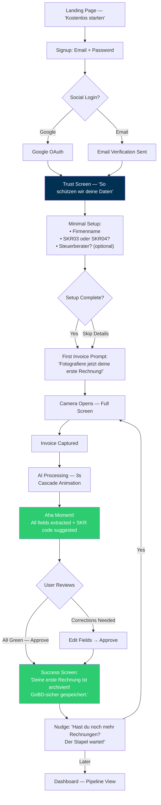
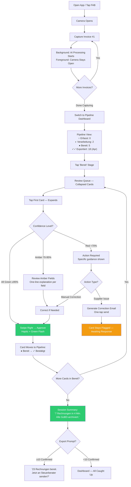
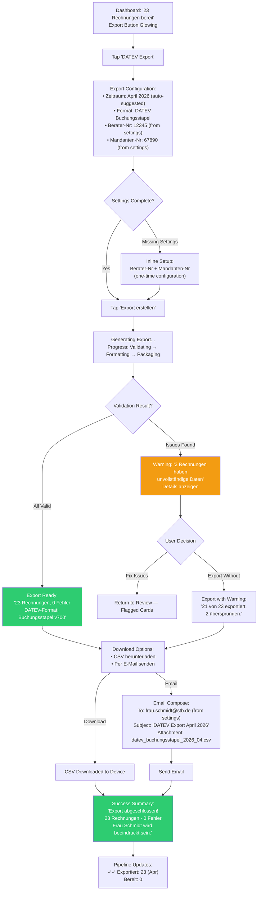
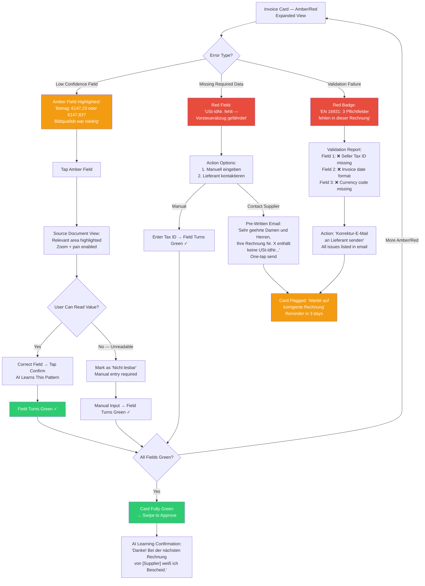

# UX Design Specification RechnungsAI

**Author:** GOZE
**Date:** 2026-04-02

---

## Executive Summary

### Project Vision

RechnungsAI is an AI-powered e-invoicing and accounting SaaS platform purpose-built for German micro-businesses with 5–20 employees — a segment structurally underserved by existing tools. Germany's Wachstumschancengesetz mandates that all businesses must send and receive structured electronic invoices (XRechnung/ZUGFeRD) by January 2028, yet 25% of SMEs remain unprepared.

The core UX promise: transform a 3-hour weekly bookkeeping chore with 8–15% error rates into a 20-minute automated workflow with under 2% errors. Snap a photo of an invoice, and AI reads it in 3 seconds with 95%+ accuracy, auto-categorizes it to SKR03/04, validates compliance, and exports to the Steuerberater via DATEV — one click.

The UX design must bridge the gap between powerful AI automation and the extremely low digital maturity of the target audience (digital maturity index: 5/100). Every design decision must prioritize simplicity, trust, and immediate value over feature richness.

### Target Users

**Primary: Thomas — The Handwerk Business Owner**

- Age 40+, owns a trade business (carpentry, plumbing, electrical), 5–20 employees
- Processes 25–30 incoming invoices weekly using Excel and Word templates
- Zero digital maturity — does bookkeeping himself after hours, badly, late at night
- Deep skepticism about cloud-based financial data storage
- Values time saved over feature richness — wants accounting to "disappear"
- Device context: Desktop for bulk processing, mobile phone for photo capture on job sites

**Primary: Lisa — The E-Commerce Operator**

- Age 25–35, runs a small online brand on Shopify/Amazon DE
- Receives 60+ supplier invoices monthly from multiple countries
- Digitally savvy but overwhelmed by German accounting rules (especially VAT complexity)
- Needs multi-format invoice handling and intra-EU VAT awareness
- Device context: Primarily desktop, occasional mobile

**Indirect: Frau Schmidt — The Steuerberater**

- Does not use RechnungsAI directly but receives DATEV exports from clients
- Judges the product by export quality — zero errors, perfect DATEV format compliance
- Becomes an organic distribution channel when impressed by data quality
- Future direct user via Steuerberater portal (Phase 4)

### Key Design Challenges

1. **Extremely low digital maturity barrier** — The primary target audience scores 5/100 on the digital maturity index. The interface must be usable by someone who has never used a SaaS product. Every extra click, every unfamiliar term, every ambiguous icon is a potential drop-off point. The core workflow (upload → review → confirm) must be completable without external help.

2. **Trust deficit with cloud financial data** — Conservative German tradespeople aged 40+ have deep skepticism about storing financial data in the cloud. Trust is not a feature — it is a prerequisite for adoption. The UX must communicate data security (German servers, GoBD compliance, DSGVO, bank-grade encryption) at every critical moment without being intrusive.

3. **AI uncertainty communication** — AI will make mistakes (poor-quality photos, crumpled receipts, unusual invoice formats). The confidence scoring system (green/amber/red) must be immediately intuitive and stress-free. Users must understand when to trust the AI and when to intervene, without feeling anxious or overwhelmed. The human-in-the-loop experience must feel like a natural quality check, not a burden.

4. **Regulatory complexity made invisible** — GoBD compliance, EN 16931 validation, SKR03/04 categorization, BU-Schlüssel mapping — the underlying domain is deeply complex. The UX must abstract this complexity entirely. Thomas should never need to know what EN 16931 means — he just sees "compliant" or "action needed."

### Design Opportunities

1. **The "aha moment" as competitive moat** — The instant transformation from photographing an invoice to seeing structured, categorized data in 3 seconds is unlike anything competitors offer. If this moment is designed with the right visual feedback, animation, and clarity, it becomes the product's most powerful sales tool. Users who experience it become evangelists.

2. **Quantified value reinforcement** — Weekly notifications ("This week you processed 12 invoices, saved ~2.5 hours, and have €2,340 in VAT deductions ready for your accountant") create tangible proof of value. This is a retention and conversion lever that most accounting tools ignore. The UX should make the user feel progressively smarter and more in control.

3. **Steuerberater as organic growth channel** — By making the DATEV export flawless, the product turns accountants into unpaid ambassadors. The UX of the export flow should emphasize quality signals that the Steuerberater will notice and appreciate, reinforcing the recommendation loop.

4. **Progressive trust building** — Rather than front-loading all security information, the UX can build trust incrementally: security screen at onboarding, badges on dashboard, confidence scoring during processing, flawless export results. Each positive interaction compounds trust, lowering resistance to deeper engagement (upgrading, processing more invoices, relying on AI suggestions).

## Core User Experience

### Defining Experience

**The "Document Destruction" Loop** — The moment a user uploads an invoice, that invoice ceases to be their problem. RechnungsAI's core experience is not "accounting software" — it is a document elimination machine. The defining interaction is a two-beat rhythm:

1. **Capture** — Snap a photo (or upload a file). The invoice is now the system's responsibility.
2. **Confirm** — Glance at the AI's work. If everything is green, approve in under 2 seconds and move on.

This loop repeats for every invoice. The measure of success is not how many features the user discovers, but how quickly each invoice disappears from their mental load. We are not selling accounting software — we are selling time back and confidence forward.

### Platform Strategy

**Mobile-First PWA — "Feels Like an App, Lives on the Web"**

- Progressive Web App with full "add to home screen" experience. The user should never perceive this as a "website" — no browser chrome, no URL bar, no tab-switching friction.
- Mobile is the primary capture device: tradespeople photograph invoices on job sites, at supplier pickups, in workshops. Desktop is the secondary platform for bulk review, export, and settings.
- Camera launch must feel native — one tap from home screen to camera viewfinder. No intermediate screens, no loading states before the camera is ready.
- Offline-resilient capture: if network is spotty on a job site, photos queue locally and sync when connectivity returns. The capture experience never breaks.
- Touch-first interaction design: swipe gestures for approval, large tap targets for confidence indicators, haptic feedback on confirmation.

### Effortless Interactions

**Capture → Process → Capture (Parallel Pipeline)**

The critical insight: users should never wait. When a photo is taken, AI processing begins immediately in the background. While invoice #1 is being processed, the user is already capturing invoice #2. The experience is a continuous flow, not a sequence of blocking steps.

- **Zero-wait capture:** Camera stays open after each photo. No "uploading..." modal. A subtle animation confirms the photo was captured and queued. The user keeps shooting.
- **Batch-then-review:** After capturing a stack of invoices (Thomas's Monday morning ritual), the user switches to review mode. All processed invoices are waiting, pre-sorted by confidence level.
- **"Tinder swipe" approval:** For high-confidence (green) invoices, approval is a single swipe right or tap. No scrolling through field details. The AI got it right — acknowledge and move on. The gesture should feel as reflexive and satisfying as dismissing a notification.
- **Attention-only-where-needed:** Amber fields pulse gently to draw the eye. Red fields require explicit action. Green fields are visually recessive — they don't demand attention. The UI guides the user's eyes only to what matters.
- **Smart defaults everywhere:** SKR plan pre-selected from onboarding. DATEV settings configured once, never asked again. Export date range auto-suggested based on last export. The system remembers so the user doesn't have to.

### Critical Success Moments

1. **The "Aha" Moment (First 30 seconds):** User photographs their first invoice and watches structured, categorized data appear in ~3 seconds. The fields populate with a satisfying cascade animation. The SKR03 code is correct. The VAT is calculated. This single moment must be flawless — it is the product's entire sales pitch compressed into one interaction. If this moment fails, nothing else matters.

2. **The "It Caught Something I Would Have Missed" Moment:** AI flags a missing USt-ID, an inconsistent amount, or a non-compliant invoice format. The user realizes: this tool isn't just faster than me — it's more careful than me. This is when trust crystallizes from "convenient tool" into "indispensable safety net."

3. **The "Monday Morning Transformation" Moment:** After 2 weeks of use, Thomas processes his entire week's invoices in 15 minutes instead of 3+ hours. The cumulative effect hits him. This is not an incremental improvement — it is a category change in how he experiences his business.

4. **The "Frau Schmidt Is Impressed" Moment:** The Steuerberater imports the DATEV export and it's perfect — zero errors, zero missing documents, zero cleanup. This external validation from a trusted authority figure (the accountant) cements the user's commitment. It also triggers organic growth: Frau Schmidt recommends it to other clients.

5. **The "Weekly Recap" Moment:** Sunday evening notification — "This week you processed 12 invoices, saved ~2.5 hours, and have €2,340 in VAT deductions ready for your accountant." Concrete, personalized proof of value. The user feels competent and in control — emotions they never associated with bookkeeping before.

### Experience Principles

1. **"The Invoice Dies on Contact"** — Every design decision must minimize the time between capture and resolution. If a feature adds steps, it must justify its existence against this principle. The invoice is a problem; the product is the solution; the interaction is the destruction of the problem.

2. **"Attention Is a Scarce Resource — Spend It Wisely"** — The UI never demands attention where the AI is confident. Green fields fade into the background. Only amber and red demand the user's focus. The user's cognitive load is proportional to the number of exceptions, not the number of invoices.

3. **"App, Not Website"** — Every interaction must feel native, immediate, and tactile. No page reloads, no loading spinners blocking user action, no "web-ness" leaking through. The PWA must be indistinguishable from a native app in feel and responsiveness.

4. **"Sell Time and Trust, Not Features"** — The product communicates its value in hours saved and errors prevented, not in feature lists. Every UI surface reinforces: "You got time back. Your data is safe. Your accountant is happy." Features are invisible infrastructure; outcomes are visible everywhere.

5. **"Progressive Trust, Not Front-Loaded Reassurance"** — Trust builds through repeated positive experiences, not through a wall of security badges. Each successful invoice processed, each error caught, each flawless export compounds into unshakeable confidence. The UX designs for trust accumulation over time.

## Desired Emotional Response

### Primary Emotional Goals

**Dominant Emotion: Competence (Yetkinlik)**

The user must feel like a capable professional who has mastered their administrative burden — not like someone struggling with technology. RechnungsAI does not make Thomas feel like he is "learning software." It makes him feel like he has always been this organized, this efficient, this precise. The tool disappears; the competence remains.

**Supporting Emotion: Pride & Discovery (Gurur ve Keşif)**

In Germany, bureaucracy is a force of nature — you cannot escape it. When Thomas tells a colleague about RechnungsAI, the emotional trigger is not "I found a cool app" — it is pride in a new professional identity: "Frau Schmidt doesn't call me anymore to chase missing documents. I send her flawless files now." The user has gone from bureaucracy victim to bureaucracy master.

**Supporting Emotion: Safety Net Confidence (Güvenlik Ağı Güveni)**

The user must feel that they are never alone with their financial data. Every interaction reinforces: "Even if something goes wrong, we catch it together." The product is a co-pilot, not an autopilot — the user retains agency and dignity while the system handles the heavy lifting.

### Emotional Journey Mapping

| Stage                     | Desired Emotion                                                   | Design Implication                                                                                                                                                                                                        |
| ------------------------- | ----------------------------------------------------------------- | ------------------------------------------------------------------------------------------------------------------------------------------------------------------------------------------------------------------------- |
| **First Discovery**       | Curiosity + Relief — "This might actually solve my problem"       | Landing page communicates time saved and Steuerberater approval, not feature lists. Free compliance checker as low-commitment entry point.                                                                                |
| **Onboarding**            | Trust + Safety — "My data is secure here"                         | German flag / server location badge. "Deine Daten bleiben in Deutschland." GoBD and DSGVO shields visible. Security screen before first upload — reassurance before vulnerability.                                        |
| **First Invoice Capture** | Wonder + Competence — "I can't believe it's this easy"            | The "aha moment" — 3-second extraction with cascade animation. SKR03 code appears correctly. The user feels like they did something impressive, even though the AI did the work.                                          |
| **Review & Confirm**      | Control + Mastery — "I understand what's happening and I approve" | Confidence scoring makes the user feel like a quality inspector, not a data entry clerk. Green fields = "AI agrees with my standards." The swipe-to-approve gesture feels decisive, not passive.                          |
| **Error Encountered**     | Collaboration + Agency — "I'm the expert here, let me help"       | Amber fields are framed as "AI needs your expertise" — not "AI failed." The user is the master craftsman; the AI is the capable apprentice asking for guidance. This reframes every error as a moment of user competence. |
| **DATEV Export**          | Relief + Pride — "This is professional-grade work"                | Export completion shows a quality summary: "12 invoices, 0 errors, DATEV-ready." The user feels the weight lift. They are sending their Steuerberater work they can be proud of.                                          |
| **Weekly Recap**          | Accomplishment + Validation — "I'm actually good at this now"     | Quantified value: hours saved, invoices processed, deductions secured. The notification is a weekly trophy — proof that the user has transformed their relationship with bookkeeping.                                     |
| **Returning Use**         | Familiarity + Anticipation — "Let me knock this out quickly"      | The app remembers everything. No re-configuration. The Monday morning ritual becomes satisfying, not dreaded. The user looks forward to the efficiency.                                                                   |

### Micro-Emotions

**Safety & Transparency (Güvende ve Şeffaf)**

- German flag icon and "Hosted in Germany" badge permanently visible in the app shell — not as a marketing claim but as a constant ambient reassurance
- Data residency is never questioned because it is never hidden
- Every AI decision is explainable: tap any field to see why the AI chose that value

**Achievement & Approval (Başarı ve Onay)**

- Haptic feedback (subtle vibration) on invoice approval — a tactile "well done"
- Green checkmark animation on successful confirmation — crisp, satisfying, brief
- Sound design consideration: optional subtle confirmation tone (like a cash register "ching") that makes processing feel productive
- Micro-celebration on milestones: "10th invoice processed!" — without being patronizing

**Control & Guidance (Kontrol ve Rehberlik)**

- Confidence scores are always visible, never hidden behind a menu
- The user can always see WHY the AI made a decision — transparency breeds trust
- Amber fields include a one-line explanation: "Amount unclear due to image quality" — specific, not vague
- The user can always override any AI decision — the system defers to human judgment

**Relief & Pride (Rahatlama ve Gurur)**

- After every batch processing session: "That took only 2 minutes" time summary
- Monthly trend: "You're processing invoices 40% faster than your first week"
- Export success screen emphasizes quality: "Zero errors. Your Steuerberater will notice."
- The emotional arc of each session is: mild dread → quick action → satisfying completion → pride

### Design Implications

| Emotional Goal                  | UX Design Approach                                                                                                                                                                                                                                                |
| ------------------------------- | ----------------------------------------------------------------------------------------------------------------------------------------------------------------------------------------------------------------------------------------------------------------- |
| **Competence**                  | UI language never talks down. No tutorials that feel like "teaching." Contextual hints appear only when needed, phrased as reminders ("You usually use SKR03 for this supplier"), not instructions. The user feels like they already know how to use the product. |
| **Pride**                       | Every output the user shares externally (DATEV export, Verfahrensdokumentation) must be visually and structurally flawless. The user's professional image is at stake. Export quality is a direct expression of user pride.                                       |
| **Safety Net**                  | Error states are never alarming. No red alert modals. No "ERROR" headlines. Amber is the strongest negative signal — warm, attention-getting, but not panic-inducing. The tone is always: "Let's look at this together."                                          |
| **Collaboration (not failure)** | When AI confidence is low, the UI frames it as partnership: "AI is 78% sure this is €147.23 — can you confirm?" The user is the expert being consulted, not the operator cleaning up mistakes.                                                                    |
| **Transparency**                | Every AI decision has a visible rationale. No black boxes. The user can tap any field to see: source document highlight, confidence percentage, and reasoning. Trust comes from understanding, not blind faith.                                                   |
| **Progressive mastery**         | The product subtly communicates improvement: "Last month you reviewed 8 amber fields. This month only 3 — the AI is learning your suppliers." The user and the AI grow together.                                                                                  |

### Emotional Design Principles

1. **"Competence, Not Compliance"** — The product makes the user feel skilled, not obedient. Every interaction reinforces: "You are a professional managing your business" — never "You are following instructions from software." The emotional frame is mastery, not submission.

2. **"Errors Are Collaboration, Not Failure"** — When something goes wrong, the emotional tone shifts to partnership. The AI is an apprentice asking the master craftsman for guidance. The user's expertise is honored. Amber means "your input needed" — never "something broke."

3. **"Every Output Is a Source of Pride"** — Everything the user shares externally — DATEV exports, Verfahrensdokumentation, compliance reports — must make them look exceptionally professional. The emotional payoff of external validation (Steuerberater's approval) is the product's most powerful retention mechanism.

4. **"Ambient Safety, Not Active Reassurance"** — Security and compliance indicators are always present but never shouting. German hosting badge, GoBD shield, DSGVO compliance — these are permanent fixtures, not pop-ups. Trust is environmental, like the solid walls of a bank vault you never think about but always feel.

5. **"Measure and Celebrate Progress"** — Time saved, accuracy improved, errors prevented — these are not just metrics but emotional rewards. Every quantified improvement is a moment of validation. The user's relationship with bookkeeping transforms from dread to quiet satisfaction.

## UX Pattern Analysis & Inspiration

### Inspiring Products Analysis

**WhatsApp — "The Thomas Standard"**

WhatsApp is the UX benchmark for RechnungsAI's primary user. Thomas uses it daily, effortlessly, without ever having been "trained." The core lesson: WhatsApp's camera flow is "see and send" — no file management, no naming conventions, no folder structures. The invoice capture experience must achieve this same level of cognitive transparency.

Key UX patterns to extract:

- **Zero-step camera access:** One tap opens the camera. No intermediate screens asking "What would you like to do?"
- **Implicit file management:** WhatsApp never asks you to name a photo or choose a save location. The system handles organization invisibly. RechnungsAI must do the same — the user captures, the system categorizes, archives, and organizes.
- **Conversation-like feedback:** WhatsApp shows delivery status with simple checkmarks (sent ✓, delivered ✓✓, read ✓✓blue). RechnungsAI's invoice status should be equally glanceable: captured → processing → ready for review → confirmed → exported.
- **Universal learnability:** Thomas's 62-year-old Meister uses WhatsApp. If the invoice capture flow requires more cognitive effort than sending a WhatsApp photo, the UX has failed.

**Duolingo — "Gamification Without Patronizing"**

Accounting is inherently boring. Duolingo proves that even disciplined, repetitive tasks can feel rewarding through streak mechanics and progressive achievement. The critical adaptation: RechnungsAI's gamification must feel professional, not childish. Thomas is a craftsman, not a student.

Key UX patterns to extract:

- **Streak mechanics for consistency:** "3 weeks without a missed invoice — Frau Schmidt would be proud!" Weekly upload consistency becomes a source of professional pride, not a chore. The streak reframes regularity as mastery.
- **Progressive difficulty acknowledgment:** Duolingo celebrates milestones without being condescending. RechnungsAI should mark meaningful moments: "50th invoice processed — your AI accuracy is now 98.5% for your top 10 suppliers." The celebration grows with the user's investment.
- **Loss aversion as motivation:** Duolingo's streak freeze mechanic creates gentle urgency. RechnungsAI equivalent: "You have 4 unprocessed invoices from last week — process them now to keep your month clean." Not a penalty — a nudge toward the user's own goal.
- **Tone calibration:** Duolingo can be playful because language learning is casual. Accounting is serious money. The gamification tone must be warm and encouraging, never silly. "Well done" — not "Awesome! 🎉🔥"

### Transferable UX Patterns

**From Competitors — What They Got Right:**

| Competitor    | Pattern Worth Adopting                                                           | How to Adapt for RechnungsAI                                                                                                                                                                                           |
| ------------- | -------------------------------------------------------------------------------- | ---------------------------------------------------------------------------------------------------------------------------------------------------------------------------------------------------------------------- |
| **Lexoffice** | Mobile OCR speed — camera opens and instantly detects the invoice document       | Go further: auto-detect invoice boundaries and capture without requiring a manual shutter tap. "Point and shoot" becomes "point and done."                                                                             |
| **sevDesk**   | VAT rate visual differentiation using color codes for 19%, 7%, 0%                | Extend to full confidence scoring: green (high confidence), amber (needs review), red (action required). VAT rates inherit the same color logic but within the broader confidence framework.                           |
| **DATEV**     | Output discipline — exports are structurally perfect regardless of input quality | Make this the invisible backbone. No matter how chaotic Thomas's Monday morning photo session is, the DATEV CSV that reaches Frau Schmidt is impeccable. The mess-to-order transformation is the product's core magic. |

**Cross-Industry Patterns:**

| Pattern                       | Source                       | Application in RechnungsAI                                                                                                                                 |
| ----------------------------- | ---------------------------- | ---------------------------------------------------------------------------------------------------------------------------------------------------------- |
| **WhatsApp checkmark status** | WhatsApp                     | Invoice lifecycle status: ○ Captured → ◐ Processing → ● Ready → ✓ Confirmed → ✓✓ Exported. Glanceable, no text needed.                                     |
| **Duolingo streaks**          | Duolingo                     | Weekly processing streaks: "4 weeks consistent — your bookkeeping is on autopilot." Professional pride, not gamification points.                           |
| **Swipe-to-action**           | Tinder / iOS Mail            | Swipe right to approve (green invoices). Swipe left to flag for review. The gesture is faster than any button tap.                                         |
| **Smart camera detection**    | Mobile banking check deposit | Auto-detect invoice boundaries in camera viewfinder. Guide alignment with overlay frame. Capture triggers automatically when document is clearly in frame. |
| **Pull-to-refresh**           | Twitter / Instagram          | Pull down on invoice list to check for newly processed invoices. Familiar gesture, satisfying animation.                                                   |

### Anti-Patterns to Avoid

**1. "Modal Hell" (Pop-up Purgatory)**

Never interrupt the core workflow with unrelated modals. No newsletter prompts during invoice processing. No "complete your profile" pop-ups during review. No "rate this app" dialogs after export. Every modal that interrupts Thomas's flow is a trust violation. The rule: modals are reserved exclusively for destructive actions (delete confirmation) or critical errors — nothing else.

**2. Forced Keyboard Input on Mobile**

Every second Thomas spends typing on a mobile keyboard increases abandonment probability. Design principle: everything must be selectable, tappable, or swipeable. When text input is unavoidable (manual correction of an AI-extracted field), use smart defaults and pre-filled suggestions so the user edits rather than types from scratch. Number fields use numeric keypad only. Date fields use date picker, never free text.

**3. Generic Technical Error Messages**

"Error 402: Mapping Failed" means "the app is broken" to Thomas. Every error message must be conversational German, specific, and actionable:

- Instead of: "OCR extraction failed" → "Ich konnte die Steuernummer auf dieser Rechnung nicht lesen. Kannst du sie eintippen?"
- Instead of: "EN 16931 validation error" → "Dieser Rechnung fehlen 3 Pflichtfelder. Wir haben eine E-Mail an den Lieferanten vorbereitet."
- Instead of: "Export failed" → "Der Export konnte nicht erstellt werden. Prüfe, ob deine DATEV-Einstellungen vollständig sind."

**4. Hidden Navigation for Critical Actions**

The DATEV Export button must never be buried in a hamburger menu. Month-end is Thomas's highest-anxiety moment — the export action must be prominently visible on the dashboard, especially when invoices are ready for export. Context-aware visibility: the export button glows or becomes more prominent when there are confirmed invoices awaiting export. Navigation hierarchy must match usage frequency, not feature taxonomy.

**5. Feature-First Onboarding**

Never start onboarding with a feature tour. Thomas doesn't care about features — he cares about solving his invoice problem. Onboarding starts with one action: "Take a photo of your first invoice." Everything else is discovered through use. Tooltips appear contextually at the moment of need, not as a pre-loaded slideshow the user skips.

### Design Inspiration Strategy

**Adopt Directly:**

- WhatsApp's zero-step camera access → Invoice capture flow
- Checkmark-based status indicators → Invoice lifecycle visualization
- Swipe gesture for quick approval → High-confidence invoice confirmation
- Auto-document detection in camera → Smart capture overlay

**Adapt for Context:**

- Duolingo streaks → Professional achievement tracking (warm tone, not playful). "Consistent bookkeeping" framing instead of "learning streaks." No mascots, no XP points — just clean progress metrics tied to business outcomes.
- Lexoffice auto-capture → Extend to full zero-tap capture where possible. When the invoice is clearly in frame, capture automatically without requiring a button press.
- sevDesk color-coded VAT → Integrate into the broader confidence scoring system. Colors serve double duty: VAT rate identification AND AI confidence level.

**Avoid Completely:**

- DATEV's complexity-first UX → The underlying DATEV format discipline is adopted, but the user-facing complexity is completely abstracted. Thomas never sees "EXTF Format" or "Buchungsstapel" — he sees "Send to Steuerberater."
- Modal interruptions for non-critical purposes → Zero tolerance policy
- Feature tour onboarding → Action-first onboarding only
- Technical jargon in any user-facing text → Conversational German at all times

## Design System Foundation

### Design System Choice

**shadcn/ui + Tailwind CSS + Radix UI Primitives**

The design system foundation for RechnungsAI is shadcn/ui — a collection of re-usable, accessible components built on Radix UI primitives and styled with Tailwind CSS. Unlike traditional component libraries installed as npm dependencies, shadcn/ui components are copied directly into the project, giving full ownership and modification control.

This is not a UI library — it is a starting point. Every component lives in the project's codebase, can be modified freely, and has zero dependency on external package updates breaking the UI.

### Rationale for Selection

**1. Solo Developer Speed**

shadcn/ui provides production-ready components out of the box — dialogs, dropdowns, forms, tables, toasts, sheets, cards — that would take weeks to build from scratch. For a solo developer targeting 8–10 week MVP, this is the difference between shipping and not shipping. The component quality is high enough that minimal customization is needed for MVP.

**2. Next.js Native Alignment**

shadcn/ui is built specifically for the React/Next.js ecosystem. It uses React Server Components where appropriate, supports the App Router, and integrates seamlessly with the Next.js build pipeline. No adapter layers, no compatibility shims, no framework mismatches.

**3. Full Ownership & Control**

Components are copied into the project (`/components/ui/`), not imported from `node_modules`. This means:

- No breaking changes from upstream library updates
- Full freedom to modify any component for RechnungsAI's specific needs
- No dependency on a third-party maintainer's roadmap
- Custom components (confidence scoring, invoice cards, swipe-to-approve) can be built using the same patterns and tokens

**4. "App, Not Website" Achievability**

Tailwind CSS + Radix primitives enable the tactile, native-feeling interactions defined in our experience principles:

- Smooth transitions and animations via Tailwind's animation utilities + Framer Motion
- Touch-optimized hit targets configurable through Tailwind spacing scale
- Dark/light mode theming with CSS custom properties
- Responsive design from mobile-first breakpoints built into Tailwind's utility system

**5. Accessibility by Default**

Radix UI primitives (the foundation under shadcn/ui) are WAI-ARIA compliant out of the box. Focus management, keyboard navigation, screen reader announcements — these are handled at the primitive level. For a regulated financial product serving users with varying abilities, accessibility is not optional.

**6. Design Token Architecture**

shadcn/ui uses CSS custom properties for theming, enabling a clean token-based design system:

- Colors, spacing, radii, and typography are defined as tokens in `globals.css`
- Theme switching (light/dark) is a single class toggle
- Brand customization happens at the token level, not per-component
- Consistent visual language across all components without manual enforcement

### Implementation Approach

**Component Structure:**

```
/components
  /ui          → shadcn/ui base components (Button, Card, Dialog, Sheet, etc.)
  /invoice     → Invoice-specific components (InvoiceCard, ConfidenceScore, SwipeApprove)
  /dashboard   → Dashboard components (StatCard, ExportButton, WeeklyRecap)
  /capture     → Capture flow components (CameraView, UploadZone, ProcessingQueue)
  /onboarding  → Onboarding components (TrustScreen, FirstInvoiceGuide)
  /layout      → App shell components (Navigation, StatusBar, MobileNav)
```

**Installation Strategy:**

1. Initialize shadcn/ui with Next.js project (`npx shadcn@latest init`)
2. Install core components needed for MVP: Button, Card, Dialog, Sheet, Input, Select, Table, Badge, Toast, Dropdown Menu, Form, Label, Separator, Skeleton, Tooltip
3. Configure Tailwind theme with RechnungsAI design tokens (colors, typography, spacing)
4. Build custom components (confidence scoring, swipe gestures, camera overlay) using the same Radix + Tailwind patterns

**Progressive Enhancement:**

- MVP: Use shadcn/ui components with minimal customization — focus on functionality
- Post-MVP: Refine visual identity, add micro-animations, polish transitions
- Phase 2+: Evaluate custom component needs as features expand

### Customization Strategy

**Design Tokens (CSS Custom Properties):**

```css
/* RechnungsAI Theme Tokens */
:root {
  /* Confidence scoring colors — core to the product */
  --confidence-high: 142 71% 45%; /* Green — AI confident */
  --confidence-medium: 38 92% 50%; /* Amber — needs review */
  --confidence-low: 0 84% 60%; /* Red — action required */

  /* Brand colors — professional, trustworthy, German-market appropriate */
  --primary: 221 83% 53%; /* Deep blue — trust, professionalism */
  --primary-foreground: 210 40% 98%;
  --secondary: 210 40% 96%;
  --accent: 142 71% 45%; /* Green — success, confirmation */

  /* Semantic colors */
  --success: 142 71% 45%;
  --warning: 38 92% 50%;
  --destructive: 0 84% 60%;

  /* Surface colors — clean, minimal, no visual noise */
  --background: 0 0% 100%;
  --foreground: 222 84% 5%;
  --card: 0 0% 100%;
  --muted: 210 40% 96%;
  --border: 214 32% 91%;

  /* Touch targets — minimum 44px for accessibility */
  --touch-target-min: 2.75rem;

  /* Animation — fast, purposeful, never decorative */
  --animation-fast: 150ms;
  --animation-normal: 250ms;
  --animation-slow: 350ms;
}
```

**Typography Scale:**

- Primary font: System font stack (`-apple-system, BlinkMacSystemFont, "Segoe UI", ...`) — fastest loading, native feel on every platform
- Headings: Semi-bold weight — authoritative but not aggressive
- Body: Regular weight, 16px minimum on mobile — readability for 40+ age group
- Numbers/amounts: Tabular figures (`font-variant-numeric: tabular-nums`) — columns align perfectly in invoice tables

**Component Customization Priorities:**

| Component    | Customization Needed                                                                  | Priority |
| ------------ | ------------------------------------------------------------------------------------- | -------- |
| **Button**   | Larger touch targets (min 44px), haptic feedback trigger, confidence-colored variants | MVP      |
| **Card**     | Invoice card layout with confidence stripe, swipe gesture support                     | MVP      |
| **Badge**    | Confidence scoring badges (green/amber/red) with pulse animation for amber            | MVP      |
| **Toast**    | Success notifications with time-saved messaging, non-intrusive positioning            | MVP      |
| **Sheet**    | Bottom sheet for mobile invoice detail view (native app feel)                         | MVP      |
| **Dialog**   | Minimal use — only for destructive confirmations. Never for marketing                 | MVP      |
| **Table**    | Invoice list with sortable columns, inline status indicators, batch selection         | MVP      |
| **Skeleton** | Loading states for AI processing — progress-oriented, not spinner-oriented            | MVP      |
| **Form**     | DATEV settings form, tenant configuration — smart defaults, minimal required fields   | MVP      |
| **Tooltip**  | Contextual help — appears on hover/long-press, explains AI decisions                  | Post-MVP |

**Custom Components to Build:**

1. **ConfidenceScore** — Visual confidence indicator per field (green/amber/red bar + percentage). Tappable to reveal AI reasoning.
2. **SwipeApprove** — Swipe-right-to-approve gesture component for invoice cards. Includes haptic feedback trigger and undo capability.
3. **CameraOverlay** — Document detection overlay for camera viewfinder. Auto-capture trigger when invoice boundaries are detected.
4. **InvoiceStatusTracker** — WhatsApp-style checkmark progression (○ → ◐ → ● → ✓ → ✓✓).
5. **ProcessingQueue** — Visual queue showing captured invoices being processed in background. Subtle progress animation.
6. **WeeklyRecapCard** — Dashboard card showing weekly value summary (invoices processed, time saved, deductions accumulated).
7. **TrustBadgeBar** — Ambient security indicator bar (German flag + "Hosted in Germany" + GoBD + DSGVO badges).

## Defining Core Experience

### The Defining Experience

**"Snap it. It's gone. Your accountant can't complain."**

This is how Thomas describes RechnungsAI to his colleague at the Stammtisch. Not "I use an AI accounting tool" — but a before/after transformation story told in one breath. The defining experience is the complete elimination of an invoice as a physical and mental burden, compressed into a gesture that takes less time than sending a WhatsApp photo.

The interaction pattern: **Capture → Witness the magic → Approve → Forget.**

This is not "invoice processing software." This is an invoice destruction ritual that happens to produce perfect accounting data as a byproduct.

### User Mental Model

**Current Model: "Chaos Accumulation" (Kaos Biriktirme)**

Thomas's current relationship with invoices follows a predictable, anxiety-producing cycle:

**Stage 1 — Physical Accumulation:**
Invoice arrives. It gets tossed onto the car dashboard, the kitchen counter, or into a shoebox. The invoice is a physical object that occupies real space and generates background anxiety. Every invoice added to the pile is another micro-stressor that Thomas can feel but chooses to ignore.

**Stage 2 — Visual Guilt:**
The growing paper pile on the desk silently screams "you have unfinished work" every time Thomas walks past it. This visual noise creates a persistent low-grade dread that colors his relationship with his own business. Bookkeeping isn't just tedious — it's psychologically punishing.

**Stage 3 — Panic Day:**
Around the 10th of the month, the box opens. Missing invoices are hunted. Frau Schmidt calls asking for documents. Stress peaks. Thomas spends 3+ hours in a state of reactive, error-prone data entry. The cycle ends with relief (it's done) and dread (it'll happen again next month).

**New Model: "Instant Destruction" (Anlık İmha)**

RechnungsAI transforms the accumulation habit into an instant elimination reflex:

- The invoice never becomes a pile. It is destroyed on contact — captured, processed, and archived in the moment it enters Thomas's awareness.
- The invoice stops being a physical object and becomes data. Data doesn't sit on the kitchen counter. Data doesn't create visual guilt. Data doesn't require a panic day.
- The Monday morning ritual shifts from dread to satisfaction. Thomas photographs a small stack of invoices in 10 minutes and they cease to exist as problems. The pile never forms.

**Mental Model Shift:**

| Dimension            | Old Model (Chaos)                  | New Model (Destruction)                           |
| -------------------- | ---------------------------------- | ------------------------------------------------- |
| Invoice =            | Physical burden to deal with later | Data to capture now and forget                    |
| Desk pile =          | Anxiety generator                  | Doesn't exist — invoices are destroyed on arrival |
| Monday morning =     | 3-hour dreaded chore               | 15-minute satisfying ritual                       |
| Month-end =          | Panic, missing documents, errors   | One-click export, zero stress                     |
| Steuerberater call = | "What's missing this time?"        | "Perfect as always, Thomas"                       |
| Bookkeeping =        | Punishment for running a business  | Invisible background process                      |

### Success Criteria

The core interaction succeeds when three "wow" moments fire in rapid succession:

**1. Supplier Recognition — "It knows me"**

When Thomas photographs a Holz-Müller invoice, the system instantly recognizes the supplier and pre-fills context: "Holz-Müller GmbH again — timber purchase, SKR03 3400, 19% VAT, as usual?" This is not just data extraction — this is the system demonstrating that it understands Thomas's business. The emotional impact: "This tool knows my world." Success metric: returning supplier recognition within the first month of use, improving from 0% to 90%+ pre-fill accuracy for top 10 suppliers.

**2. VAT Precision — "It's smarter than me"**

The gross amount appears, and in the same instant, the 19% VAT is cleanly separated — net, VAT, gross, all correct to the cent. Thomas couldn't do this faster with a calculator. The system doesn't just read numbers — it understands German tax logic. Success metric: 99.5%+ accuracy on VAT extraction and calculation for standard 19% and 7% rates.

**3. Compliance Seal — "I'm protected"**

A visual stamp appears on the processed invoice: "GoBD-Safe — Archived." This is the emotional completion signal. The invoice is not just processed — it is legally secured. Thomas doesn't need to understand GoBD; he just needs to see that seal and feel safe. Success metric: 100% of confirmed invoices receive immutable archive status within 1 second of confirmation.

**Composite Success Indicator:**

The core interaction is successful when Thomas processes an invoice and his internal monologue shifts from "I hope I'm doing this right" to "Of course it's right — it always is." This trust transition typically occurs within 2 weeks of consistent use (10–15 invoices processed).

### Novel UX Patterns

**Pattern Strategy: "Experience Remix" — Not invention, but recombination.**

RechnungsAI does not require Thomas to learn anything new. Instead, it takes three interaction patterns already encoded in his muscle memory and remixes them into a single accounting workflow:

**Remix Component 1: Instagram/WhatsApp Camera Pattern**

- Source: The world's most familiar digital reflex — open camera, point, capture
- Application: Invoice capture is identical to taking a WhatsApp photo. Camera opens, invoice is in frame, tap (or auto-capture). No file browsers, no upload dialogs, no "choose from gallery" screens
- Why it works: Thomas does this 20+ times daily for WhatsApp. Zero learning curve. The gesture is pre-trained.

**Remix Component 2: German Mobile Banking Photo-Transfer (Foto-Überweisung)**

- Source: German banking apps (Sparkasse, Commerzbank) where users photograph bills to initiate payments
- Application: The concept of "photograph a financial document → system extracts data → confirm and submit" is already normalized in Thomas's banking experience
- Why it works: Thomas already trusts this pattern with his money. Applying it to invoices feels like a natural extension, not a new behavior. The trust transfer from banking to accounting reduces adoption friction.

**Remix Component 3: Notification Dismissal Swipe**

- Source: Every smartphone user dismisses completed notifications with a swipe gesture
- Application: Approved invoices are swiped away — a physical gesture of "this is done, remove it from my attention." The swipe is both functional (confirms the invoice) and emotional (the problem physically leaves the screen)
- Why it works: Swiping away a completed item is the most satisfying micro-interaction on a smartphone. It triggers a tiny dopamine hit of task completion. Applied to invoices, each swipe is a moment of "one less thing to worry about."

**The Remix Result:**

Camera capture (WhatsApp) → AI extraction (banking photo-transfer) → Swipe to approve (notification dismissal) = A complete accounting workflow built entirely from pre-existing muscle memory. No tutorials needed. No learning curve. Thomas's fingers already know what to do.

### Experience Mechanics

**Phase 1: Initiation — "The Capture Trigger"**

| Mechanic               | Detail                                                                                                                                                                                                   |
| ---------------------- | -------------------------------------------------------------------------------------------------------------------------------------------------------------------------------------------------------- |
| **Entry point**        | Single tap on floating action button (FAB) or home screen PWA icon → camera opens immediately                                                                                                            |
| **Camera behavior**    | Full-screen viewfinder with document detection overlay. Subtle frame guide appears when invoice edges are detected.                                                                                      |
| **Auto-capture**       | When the system detects a clearly framed invoice (edges visible, adequate lighting, minimal blur), capture triggers automatically with a subtle shutter animation + haptic pulse. Manual tap also works. |
| **Multi-capture mode** | After first capture, camera stays open. A small counter badge shows "1 captured" → "2 captured" → etc. Thomas keeps shooting until the stack is done.                                                    |
| **Upload fallback**    | For PDF/XML files: drag-and-drop zone on desktop, "share to app" on mobile. Files enter the same processing queue as photos.                                                                             |
| **Offline resilience** | If network is unavailable, photos are queued locally with a "waiting to sync" indicator. Processing begins automatically when connectivity returns.                                                      |

**Phase 2: Processing — "The Magic Window"**

| Mechanic                  | Detail                                                                                                                                                                                                                                                                                 |
| ------------------------- | -------------------------------------------------------------------------------------------------------------------------------------------------------------------------------------------------------------------------------------------------------------------------------------- |
| **Background processing** | AI extraction begins immediately upon capture. The user is never blocked — they can keep capturing or switch to other tasks.                                                                                                                                                           |
| **Progress indication**   | WhatsApp-style status progression on each invoice card: ○ Captured → ◐ Processing → ● Ready for review. No percentage bars — the transition is fast enough that precise progress is unnecessary.                                                                                       |
| **Processing animation**  | When AI completes extraction, the invoice card transforms: a brief cascade animation reveals the extracted fields (supplier name, amount, VAT, SKR code) appearing one by one, top to bottom, in ~800ms. This is the "aha moment" animation — it must feel like watching magic happen. |
| **Batch readiness**       | When all captured invoices are processed, a notification pulse: "5 invoices ready for review."                                                                                                                                                                                         |

**Phase 3: Review — "The Quality Inspection"**

| Mechanic                            | Detail                                                                                                                                                                                                                                                                         |
| ----------------------------------- | ------------------------------------------------------------------------------------------------------------------------------------------------------------------------------------------------------------------------------------------------------------------------------ |
| **Review queue**                    | Invoices presented as swipeable cards, sorted by confidence level: green (high confidence) first, amber second, red last. Thomas handles the easy ones first, building momentum.                                                                                               |
| **Green invoice (high confidence)** | Full card visible with all fields. Everything green. Swipe right to approve — single gesture, <1 second. The card slides off screen with a satisfying haptic pulse and a green checkmark flash.                                                                                |
| **Amber invoice (needs attention)** | Card highlights specific amber fields with a gentle pulse. One-line explanation per field: "Amount: €147.23 or €147.83? Image quality was low." Thomas taps the field, sees the source document with the relevant area highlighted, corrects if needed, and swipes to approve. |
| **Red invoice (action required)**   | Card shows clear action items: "Supplier tax ID missing — Vorsteuerabzug at risk." Pre-written correction email available with one tap. After action is taken, card transitions to amber → green flow.                                                                         |
| **Supplier recognition feedback**   | For returning suppliers, the card shows: "Holz-Müller GmbH — recognized. Same as your last 6 invoices from this supplier." This builds the "it knows me" feeling.                                                                                                              |
| **Undo capability**                 | Accidentally swiped? A 5-second toast appears at the bottom: "Invoice approved. Undo?" One tap reverses the action. No permanent mistakes.                                                                                                                                     |

**Phase 4: Completion — "The Destruction Confirmation"**

| Mechanic                   | Detail                                                                                                                                                                             |
| -------------------------- | ---------------------------------------------------------------------------------------------------------------------------------------------------------------------------------- |
| **Session summary**        | After all invoices in the batch are reviewed: "Done! 7 invoices processed in 4 minutes. All GoBD-archived." Time comparison: "This used to take you ~1 hour 45 minutes."           |
| **Compliance seal**        | Each confirmed invoice receives a visual "GoBD-Safe" stamp in the archive view. The stamp is ambient — always visible but never in the way.                                        |
| **Dashboard update**       | Invoice count updates in real-time. The "Ready for Export" counter increments. If enough invoices are ready, the DATEV Export button subtly glows — inviting but not interrupting. |
| **Weekly streak update**   | If this session maintains the weekly processing streak: "Week 4 of consistent bookkeeping. Your records are impeccable."                                                           |
| **Next action suggestion** | Contextual: "You have 23 confirmed invoices. Export to DATEV?" or "All caught up! See you next Monday." The system knows what comes next and gently suggests it.                   |

## Visual Design Foundation

### Color System

**Theme: "German Engineering Trust" (Alman Mühendisliği Güveni)**

The color system is built on the emotional foundation of institutional German trust — the visual language of Deutsche Bank, Allianz, and TÜV. Every color choice answers one question: "Does this make Thomas feel his financial data is in competent hands?"

**Primary Palette:**

| Role                   | Color         | Hex     | HSL Token    | Emotional Function                                                                                                          |
| ---------------------- | ------------- | ------- | ------------ | --------------------------------------------------------------------------------------------------------------------------- |
| **Primary**            | Prussian Blue | #003153 | 204 100% 16% | "I am here and your data is safe." Institutional authority without coldness. Used for navigation, headers, primary actions. |
| **Primary Light**      | Steel Blue    | #4682B4 | 207 44% 49%  | Interactive states — hover, focus rings, active elements. Lighter but still authoritative.                                  |
| **Primary Foreground** | White         | #FFFFFF | 0 0% 100%    | Text on primary backgrounds. Maximum contrast for readability.                                                              |

**Semantic Palette:**

| Role                             | Color         | Hex     | HSL Token   | Emotional Function                                                                                                                                       |
| -------------------------------- | ------------- | ------- | ----------- | -------------------------------------------------------------------------------------------------------------------------------------------------------- |
| **Success / Confidence High**    | Emerald Green | #2ECC71 | 145 63% 49% | "Invoice processed. VAT secured." Traffic light "GO" — unambiguous permission to proceed. Used for confirmed fields, approve actions, completion states. |
| **Warning / Confidence Medium**  | Warm Amber    | #F39C12 | 37 90% 51%  | "Your expertise needed here." Warm, attention-getting, not alarming. Used for uncertain AI fields, gentle nudges.                                        |
| **Destructive / Confidence Low** | Soft Red      | #E74C3C | 6 78% 57%   | "Action required — but don't panic." Firm but not aggressive. Used for validation errors, missing data, compliance issues.                               |
| **Info**                         | Ocean Blue    | #3498DB | 204 70% 53% | Neutral information — tooltips, help text, AI reasoning explanations.                                                                                    |

**Neutral Palette:**

| Role               | Color       | Hex     | HSL Token   | Usage                                                                                                  |
| ------------------ | ----------- | ------- | ----------- | ------------------------------------------------------------------------------------------------------ |
| **Foreground**     | Charcoal    | #2C3E50 | 210 29% 24% | Primary text — dark enough for contrast, softer than pure black.                                       |
| **Secondary Text** | Slate Gray  | #708090 | 210 14% 53% | Secondary information, labels, timestamps. Reduces eye strain vs. black while maintaining readability. |
| **Muted**          | Light Slate | #94A3B8 | 215 16% 65% | Disabled states, placeholder text, tertiary information.                                               |
| **Border**         | Silver      | #CBD5E1 | 214 32% 91% | Card borders, dividers, input outlines. Subtle structure without visual weight.                        |
| **Surface**        | Ghost White | #F8FAFC | 210 40% 98% | Card backgrounds, elevated surfaces. Just barely off-white for depth.                                  |
| **Background**     | Snow        | #F1F5F9 | 210 40% 96% | Page background. Cool-toned white that feels clean and professional.                                   |
| **Card**           | White       | #FFFFFF | 0 0% 100%   | Primary content cards. Pure white for maximum contrast against background.                             |

**Confidence Scoring Color System (Core Product Colors):**

The confidence traffic light is the most frequently seen color system in the product. It must be instantly readable at a glance:

- **Green zone (>95% confidence):** Emerald Green (#2ECC71) — background tint on fields, left border stripe on invoice cards. Visually recessive — doesn't demand attention.
- **Amber zone (70–95% confidence):** Warm Amber (#F39C12) — gentle pulse animation on fields, amber left border stripe. Draws the eye without creating anxiety.
- **Red zone (<70% confidence):** Soft Red (#E74C3C) — static highlight on fields, red left border stripe with action badge. Requires explicit interaction but never feels like an "error screen."

**Dark Mode Consideration:**

Not included in MVP. The primary user (Thomas, 40+, low digital maturity) expects a "normal" light interface. Dark mode is a Phase 2+ consideration for power users and evening use. The color token architecture supports dark mode addition without component changes — only token values need to be remapped.

**CSS Custom Properties (Updated):**

```css
:root {
  /* Primary — Prussian Blue authority */
  --primary: 204 100% 16%;
  --primary-light: 207 44% 49%;
  --primary-foreground: 0 0% 100%;

  /* Confidence scoring — the product's visual heartbeat */
  --confidence-high: 145 63% 49%;
  --confidence-medium: 37 90% 51%;
  --confidence-low: 6 78% 57%;

  /* Semantic */
  --success: 145 63% 49%;
  --warning: 37 90% 51%;
  --destructive: 6 78% 57%;
  --info: 204 70% 53%;

  /* Neutrals — Slate Gray family */
  --foreground: 210 29% 24%;
  --secondary-foreground: 210 14% 53%;
  --muted: 215 16% 65%;
  --muted-foreground: 215 16% 65%;
  --border: 214 32% 91%;
  --surface: 210 40% 98%;
  --background: 210 40% 96%;
  --card: 0 0% 100%;
  --card-foreground: 210 29% 24%;

  /* Accent — reuses success for positive actions */
  --accent: 145 63% 49%;
  --accent-foreground: 0 0% 100%;
}
```

**Accessibility Compliance:**

All color combinations must meet WCAG 2.1 AA minimum contrast ratios:

- Normal text: 4.5:1 minimum (Charcoal #2C3E50 on White = 12.1:1 ✓)
- Large text/headings: 3:1 minimum (Prussian Blue #003153 on White = 14.8:1 ✓)
- Interactive elements: 3:1 minimum against adjacent colors
- Confidence colors always paired with icons/text — never color-alone signaling (colorblind safety)

### Typography System

**Philosophy: "Clarity and Discipline" (Netlik ve Disiplin)**

The typography says: "I am an accountant, but I live in 2026." No ornamental serifs, no playful display fonts. Clean, geometric, optimized for the one thing that matters most in accounting software: reading numbers accurately.

**Primary Typeface: Inter**

- **Why Inter:** Designed specifically for screen readability. High x-height for small sizes. Distinctive letterforms reduce misreading (especially important for financial data: 0/O, 1/l/I, 5/S). Tabular figures available natively — columns of numbers align perfectly without monospace hacks.
- **Why not system fonts:** While system fonts load fastest, Inter's tabular figure support and consistent cross-platform rendering are critical for financial data display. The 15KB WOFF2 load is justified by the accuracy improvement in number readability.
- **Fallback stack:** `'Inter', -apple-system, BlinkMacSystemFont, 'Segoe UI', sans-serif`

**Type Scale (Mobile-First):**

| Token         | Size (Mobile)   | Size (Desktop)  | Weight          | Line Height | Usage                                             |
| ------------- | --------------- | --------------- | --------------- | ----------- | ------------------------------------------------- |
| **display**   | 28px / 1.75rem  | 36px / 2.25rem  | 700 (Bold)      | 1.2         | Dashboard hero numbers ("€12,340 processed")      |
| **h1**        | 24px / 1.5rem   | 30px / 1.875rem | 600 (Semi-bold) | 1.3         | Page titles ("Rechnungen", "Dashboard")           |
| **h2**        | 20px / 1.25rem  | 24px / 1.5rem   | 600 (Semi-bold) | 1.35        | Section headers ("This Week", "Ready for Export") |
| **h3**        | 17px / 1.063rem | 20px / 1.25rem  | 600 (Semi-bold) | 1.4         | Card headers, subsection titles                   |
| **body**      | 16px / 1rem     | 16px / 1rem     | 400 (Regular)   | 1.5         | Primary content text, descriptions                |
| **body-sm**   | 14px / 0.875rem | 14px / 0.875rem | 400 (Regular)   | 1.5         | Secondary text, labels, metadata                  |
| **caption**   | 12px / 0.75rem  | 12px / 0.75rem  | 400 (Regular)   | 1.4         | Timestamps, helper text, fine print               |
| **amount**    | 18px / 1.125rem | 20px / 1.25rem  | 600 (Semi-bold) | 1.2         | Invoice amounts — tabular nums, always prominent  |
| **amount-lg** | 24px / 1.5rem   | 32px / 2rem     | 700 (Bold)      | 1.1         | Dashboard totals, export summaries                |

**Number Display Rules:**

- All financial amounts use `font-variant-numeric: tabular-nums` — columns align perfectly
- Euro symbol (€) precedes the amount with a thin space: `€ 1.234,56`
- German locale formatting: period for thousands separator, comma for decimal (`1.234,56`)
- VAT breakdown always shows: Netto / USt / Brutto in consistent alignment
- Confidence percentages displayed in the same tabular style: `97,3%`

**Font Weight Strategy:**

- **Bold (700):** Hero numbers, dashboard totals — demands attention for key metrics
- **Semi-bold (600):** Headings, invoice amounts, action labels — authoritative without shouting
- **Regular (400):** Body text, descriptions, secondary content — clean and effortless to read
- Never use Light (300) or Thin (100) — Thomas reads on mobile in variable lighting conditions. Thin fonts disappear.

### Spacing & Layout Foundation

**Philosophy: "Hierarchical Spaciousness" — Thomas's Workshop Metaphor**

The layout follows the workshop principle: the entrance is clean and inviting (dashboard), the workbench has every tool within arm's reach (review screen). Information density adapts to the user's current mode.

**Spacing Scale (4px Base Unit):**

| Token        | Value | Usage                                                         |
| ------------ | ----- | ------------------------------------------------------------- |
| **space-0**  | 0px   | Reset, no spacing                                             |
| **space-1**  | 4px   | Minimal gap — between icon and label, inline elements         |
| **space-2**  | 8px   | Tight grouping — between related form fields, badge padding   |
| **space-3**  | 12px  | Standard inner padding — card content padding, list item gaps |
| **space-4**  | 16px  | Standard outer padding — section margins, card gaps on mobile |
| **space-5**  | 20px  | Comfortable breathing room — between card groups              |
| **space-6**  | 24px  | Section separation — between dashboard sections               |
| **space-8**  | 32px  | Major section breaks — page-level spacing                     |
| **space-10** | 40px  | Hero spacing — dashboard top area, empty states               |
| **space-12** | 48px  | Maximum spacing — page margins on desktop                     |

**Contextual Density Model:**

**Dashboard Mode — "The Workshop Entrance" (Ferah)**

- Generous white space between cards (space-6 to space-8)
- Maximum 3–4 information cards visible above the fold
- Large touch targets for primary actions (FAB: 56px, cards: full-width)
- Macro data only: invoice count, weekly summary, export readiness
- Breathing room communicates calm and control: "Everything is under control"

**Review Mode — "The Workbench" (Yoğun)**

- Compact card layout with space-3 to space-4 gaps
- All relevant invoice data visible without scrolling (supplier, amount, VAT, SKR code, confidence)
- Side-by-side comparison: source document thumbnail + extracted data on desktop
- Stacked layout on mobile: extracted data card on top, source document accessible via swipe-up
- Efficiency-first: every pixel serves a purpose, no decorative spacing

**Export/Settings Mode — "The Filing Cabinet" (Yapılandırılmış)**

- Form-based layouts with clear label-field alignment
- Standard spacing (space-4 to space-6) between form groups
- Logical grouping: DATEV settings together, company details together
- Progress indicators for multi-step processes

**Grid System:**

- Mobile: Single column, full-width cards, 16px (space-4) horizontal padding
- Tablet (768px+): 2-column grid for dashboard cards, single column for review
- Desktop (1024px+): 12-column grid, max-width 1280px, centered
- Invoice review on desktop: 60/40 split (extracted data / source document preview)

**Touch Target Minimums:**

- Primary actions (capture, approve, export): 48px minimum height
- Secondary actions (filter, sort, settings): 44px minimum height
- Swipe gesture activation zone: full card width, 60px minimum height
- FAB (Floating Action Button) for capture: 56px diameter

**Border Radius Scale:**

| Token           | Value  | Usage                          |
| --------------- | ------ | ------------------------------ |
| **radius-sm**   | 6px    | Buttons, badges, input fields  |
| **radius-md**   | 8px    | Cards, dropdowns, tooltips     |
| **radius-lg**   | 12px   | Modal dialogs, bottom sheets   |
| **radius-xl**   | 16px   | Dashboard hero cards           |
| **radius-full** | 9999px | FAB, avatar, circular elements |

Rounded corners communicate approachability. No sharp 0px corners except for full-bleed elements (navigation bar, status bar). The slight roundness says: "I'm professional but not intimidating."

### Accessibility Considerations

**Visual Accessibility:**

- All text meets WCAG 2.1 AA contrast ratios (4.5:1 normal text, 3:1 large text)
- Confidence colors never used alone — always paired with icons (✓ checkmark, ⚠ warning triangle, ✕ error cross) and text labels
- Focus indicators: 2px solid ring in Primary Light (#4682B4) with 2px offset — clearly visible on all backgrounds
- Minimum font size: 12px (caption). Primary content never below 16px.
- Touch targets: minimum 44px (WCAG 2.5.5 Target Size)

**Cognitive Accessibility (Critical for Target Audience):**

- Maximum 3 actions visible per screen context — no "wall of buttons"
- Consistent placement of primary actions (always bottom-right on mobile, always top-right on desktop)
- Status colors always accompanied by plain-language German text: not just green, but "Alles korrekt"
- Progressive disclosure: advanced options hidden behind "Mehr anzeigen" — never cluttering the default view
- No auto-advancing screens or time-limited interactions — Thomas works at his own pace

**Motion Accessibility:**

- All animations respect `prefers-reduced-motion` system setting
- Reduced motion mode: instant state changes instead of transitions, no pulse animations
- No animation is required to understand the interface — animations enhance but never carry meaning

## Design Direction Decision

### Design Directions Explored

Six distinct design directions were created and evaluated as interactive HTML mockups (`ux-design-directions.html`):

1. **Minimal Trust** — Ultra-clean dashboard with maximum white space and 3 hero stat cards
2. **Workbench Density** — Information-rich compact rows with inline confidence indicators
3. **Card Stack** — Tinder-inspired single swipeable card interface
4. **Progressive Reveal** — Accordion-style expand-on-demand with minimal initial cognitive load
5. **Split View** — Desktop-optimized document + data side-by-side layout
6. **Status Timeline** — Process-oriented pipeline view with stage indicators

### Chosen Direction

**"Pipeline + Progressive Reveal" — Direction 6 base with Direction 4 accordion mechanics**

The chosen design direction combines the process-oriented pipeline structure of Direction 6 with the expand-on-demand simplicity of Direction 4. This hybrid creates a dashboard that communicates progress and process without overwhelming the user with information density.

**Core Structure:**

The dashboard is organized around the invoice lifecycle pipeline:

```
Erfasst (Captured) → Verarbeitung (Processing) → Bereit (Ready) → Exportiert (Exported)
```

Each pipeline stage is a visual lane showing the count of invoices in that stage. The user's attention is naturally drawn to the "Bereit" stage — invoices ready for review — which is the primary action zone.

**Pipeline Header Bar:**

A horizontal bar at the top of the dashboard showing all four stages with counts. The active/attention-needed stage is visually emphasized (bold count, subtle pulse on the "Bereit" badge if invoices are waiting). This gives Thomas an instant overview: "Where are my invoices right now?"

```
○ Erfasst: 2  |  ◐ Verarbeitung: 1  |  ● Bereit: 5  |  ✓✓ Exportiert: 23 (Apr)
```

**Accordion Invoice Cards (from Direction 4):**

Within each pipeline stage, invoices are displayed as collapsed cards by default:

- **Collapsed state:** Single line — supplier name + amount + confidence indicator (colored left border). Tappable to expand.
- **Expanded state:** Full extracted data (all fields, VAT breakdown, SKR code, confidence scores per field), source document thumbnail, action buttons (approve/flag/edit).

This keeps the interface clean when scanning many invoices, while providing full detail on demand. Thomas sees the forest (pipeline overview) before the trees (individual invoice details).

**Time-Scoped Statistics:**

Dashboard statistics are scoped to meaningful time periods, not cumulative totals:

| Stat                   | Scope                               | Rationale                                                                                                                    |
| ---------------------- | ----------------------------------- | ---------------------------------------------------------------------------------------------------------------------------- |
| **Invoices processed** | This week / This month (toggleable) | Weekly for the Monday morning ritual view, monthly for end-of-month export context                                           |
| **Exported to DATEV**  | This month                          | Monthly aligns with the Steuerberater export cycle. "23 Rechnungen im April exportiert" is meaningful; "2,847 total" is not. |
| **Time saved**         | This week                           | Immediate reinforcement of value. "~45 Min. diese Woche gespart"                                                             |
| **Processing streak**  | Consecutive weeks                   | Gamification metric — "4 Wochen in Folge"                                                                                    |

The toggle between weekly and monthly is a simple tab at the top of the stats area — not a settings page. Default: shows whichever is most relevant based on context (beginning of month = monthly so far, mid-week = weekly).

### Design Rationale

**Why Pipeline View (Direction 6) as base:**

1. **Matches the "Destruction" mental model.** The pipeline visually shows invoices moving from "problem" (Erfasst) to "solved" (Exportiert). Thomas can literally watch his invoices being destroyed — progressing through stages toward elimination. This is the UX embodiment of "The Invoice Dies on Contact."

2. **Natural workflow guidance.** The pipeline tells Thomas what to do next without explicit instructions. If "Bereit: 5" is highlighted, he knows: "I need to review 5 invoices." If "Exportiert" shows this month's count, he knows: "My accountant has what she needs." The interface is self-documenting.

3. **Reduces cognitive load through categorization.** Instead of a flat list of 30 invoices in various states, the pipeline pre-sorts them by status. Thomas never asks "What's the status of this invoice?" — the position in the pipeline answers that question.

4. **WhatsApp-style status progression.** The ○ → ◐ → ● → ✓ → ✓✓ indicators are a direct adaptation of WhatsApp's delivery status — familiar, glanceable, and emotionally satisfying as invoices progress through stages.

**Why Accordion/Progressive Reveal (Direction 4) for invoice cards:**

1. **Prevents information overload.** A pipeline with 5+ invoices per stage, each showing all extracted fields, would be visually overwhelming. Collapsed cards show only what's needed for scanning: who and how much. Details appear only when Thomas chooses to engage.

2. **Supports both scanning and inspection modes.** Thomas in "overview mode" (Monday morning coffee, quick check) sees collapsed cards. Thomas in "workbench mode" (reviewing invoices) expands cards one by one. Same interface, two levels of engagement.

3. **Clean and uncluttered aesthetic.** The accordion pattern naturally creates white space between collapsed items, supporting the "Workshop Entrance" (ferah) feeling on the dashboard while still enabling "Workbench" (yoğun) density when expanded.

**Why time-scoped statistics instead of cumulative:**

A user processing ~30 invoices/week will accumulate ~1,500+ invoices per year. "1,547 Rechnungen exportiert" is meaningless noise after month 3 — it doesn't tell Thomas anything actionable. "23 Rechnungen im April exportiert" immediately communicates: "Am I on track this month?" The monthly export count aligns with the natural Steuerberater export cycle and keeps numbers in a human-comprehensible range.

### Implementation Approach

**Dashboard Layout (Mobile — Primary):**

```
┌─────────────────────────────┐
│ 🇩🇪 Gehostet in Deutschland  │  ← TrustBadgeBar (ambient)
├─────────────────────────────┤
│ Guten Morgen, Thomas        │  ← Greeting + date
│                             │
│ ┌───────┬──────┬──────┐     │
│ │ 45m   │ 27   │ 4W.  │     │  ← Stats row (time saved /
│ │gespart│ Apr  │Streak│     │     processed this month / streak)
│ └───────┴──────┴──────┘     │
│                             │
│ ○ Erfasst          2        │  ← Pipeline stage headers
│ ├ Holz-Müller  € 1.234,56   │     (collapsed cards)
│ └ Bauhaus      €   89,90    │
│                             │
│ ◐ Verarbeitung      1       │
│ └ ░░░░░░░░░░░      ···      │     (processing shimmer)
│                             │
│ ● Bereit            5  ← ── │  ← Attention indicator
│ ├ Elektro-Schmidt € 456,78  │
│ │  ┌─────────────────────┐  │     (one card expanded)
│ │  │ Rechnungsnr: R-2024 │  │
│ │  │ Netto:    € 383,85  │  │
│ │  │ USt 19%:  €  72,93  │  │
│ │  │ Brutto:   € 456,78  │  │
│ │  │ SKR03:    4940  ● ✓ │  │
│ │  │ Konfidenz: 97,3%    │  │
│ │  │ [Freigeben] [Flag]  │  │
│ │  └─────────────────────┘  │
│ ├ Schreinerei K. €  234,00  │
│ ├ Farben GmbH    €  567,12  │
│ └ ...2 weitere              │
│                             │
│ ✓✓ Exportiert    23 (Apr)   │
│    Letzter Export: 28.03.   │
│                             │
├─────────────────────────────┤
│  🏠    ＋ (Capture)    📁   │  ← Bottom nav
└─────────────────────────────┘
```

**Dashboard Layout (Desktop — 1024px+):**

Same pipeline structure but with wider cards allowing more inline information in collapsed state. The "Bereit" stage gets visual priority (larger area, left-positioned). Export action button is prominent when invoices are ready.

**Interaction Specifications:**

| Interaction                  | Gesture/Action                     | Result                                                                                               |
| ---------------------------- | ---------------------------------- | ---------------------------------------------------------------------------------------------------- |
| Tap collapsed card           | Tap anywhere on the card           | Card expands with slide-down animation (250ms ease-out). Other cards in same stage remain collapsed. |
| Tap expanded card header     | Tap the supplier/amount row        | Card collapses back (200ms ease-in)                                                                  |
| Swipe right on expanded card | Swipe gesture (>50% threshold)     | Approve invoice — card moves to next pipeline stage with slide animation                             |
| Swipe left on expanded card  | Swipe gesture (>50% threshold)     | Flag for review — amber highlight, stays in "Bereit"                                                 |
| Tap pipeline stage header    | Tap "● Bereit 5"                   | Scrolls to that stage section, expands first card                                                    |
| Pull to refresh              | Pull down gesture                  | Refreshes pipeline counts, checks for newly processed invoices                                       |
| Stats period toggle          | Tap "Diese Woche" / "Dieser Monat" | Stats switch between weekly and monthly view with crossfade                                          |

**Animation Specifications:**

| Animation                 | Duration    | Easing      | Purpose                                              |
| ------------------------- | ----------- | ----------- | ---------------------------------------------------- |
| Card expand               | 250ms       | ease-out    | Reveal detail — slightly slower for readability      |
| Card collapse             | 200ms       | ease-in     | Dismiss detail — slightly faster, snappier           |
| Pipeline stage transition | 350ms       | ease-in-out | Invoice moving between stages — must feel satisfying |
| Confidence pulse (amber)  | 2000ms loop | ease-in-out | Gentle attention draw on uncertain fields            |
| Approve swipe             | 300ms       | ease-out    | Card slides off right with green flash               |
| Stats crossfade           | 200ms       | ease        | Period toggle — subtle, no jarring change            |
| Processing shimmer        | continuous  | linear      | Skeleton loading on cards in "Verarbeitung" stage    |

## User Journey Flows

### Journey 1: First-Time Onboarding — "From Stranger to First Aha"

**Goal:** Thomas goes from zero to processing his first invoice in under 5 minutes. The onboarding must build trust, minimize friction, and deliver the "aha moment" before Thomas has time to doubt his decision.

**Entry Point:** Thomas clicks "Kostenlos starten" on the landing page after discovering RechnungsAI through a Handwerkskammer e-Rechnung seminar or Google search.



**Screen-by-Screen Detail:**

| Screen                   | Content                                                                                                                                                  | Duration           | Critical UX Rules                                                                                                  |
| ------------------------ | -------------------------------------------------------------------------------------------------------------------------------------------------------- | ------------------ | ------------------------------------------------------------------------------------------------------------------ |
| **Signup**               | Email + password only. Google OAuth as alternative. No phone number, no company details yet.                                                             | <30 seconds        | No credit card. No mandatory fields beyond email/password.                                                         |
| **Trust Screen**         | Full-screen: German flag, "Gehostet in Deutschland", GoBD shield, DSGVO badge, bank-grade encryption icon. One sentence each. "Weiter" button at bottom. | 10 seconds reading | This screen is NOT skippable — it is the trust foundation. But it's concise, not a wall of text.                   |
| **Company Setup**        | 3 fields max: Company name, SKR plan toggle (03/04), optional Steuerberater name. All other settings can be configured later.                            | <60 seconds        | "Später ergänzen" link visible. Thomas should not feel blocked by form fields.                                     |
| **First Invoice Prompt** | Full-screen with camera icon. "Fotografiere jetzt deine erste Rechnung!" Large, inviting, impossible to misunderstand.                                   | 5 seconds          | No feature tour. No slideshow. One action: take a photo.                                                           |
| **Camera**               | Full-screen viewfinder with document detection overlay. Auto-capture when invoice is clearly in frame.                                                   | <10 seconds        | Camera MUST open fast (<500ms). Any delay here kills the momentum.                                                 |
| **AI Processing**        | Captured photo with processing overlay. Fields appear one by one in cascade animation (~800ms total).                                                    | ~3 seconds         | No loading spinner. The cascade animation IS the loading state — it communicates progress and builds anticipation. |
| **Aha Moment**           | All extracted fields visible with green confidence indicators. SKR code suggested. VAT calculated. "Freigeben" button prominent.                         | User-paced         | This is the most important screen in the entire product. Every pixel matters.                                      |
| **Success**              | "Deine erste Rechnung ist archiviert! GoBD-sicher gespeichert." Subtle green pulse and checkmark.                                                        | 3 seconds          | Immediately followed by nudge to capture more. Momentum is everything.                                             |

**Onboarding Metrics:**

- Signup → First invoice captured: <3 minutes (target)
- First invoice captured → Approved: <30 seconds
- Drop-off rate at Trust Screen: <5% (if higher, screen needs simplification)
- Drop-off rate at Company Setup: <10% (if higher, reduce required fields)

### Journey 2: Daily Capture & Review — "The Destruction Ritual"

**Goal:** Thomas captures a batch of invoices (typically 5–10 on Monday morning) and reviews/approves them in a single flow. The entire session takes under 15 minutes.

**Entry Point:** Thomas opens the PWA from his home screen on Monday morning, or taps the capture FAB when a new invoice arrives during the week.



**Capture Phase Detail:**

| State                         | Visual Feedback                                       | User Action           |
| ----------------------------- | ----------------------------------------------------- | --------------------- |
| Camera active                 | Full-screen viewfinder, document detection overlay    | Point at invoice      |
| Document detected             | Green frame appears around invoice edges              | Hold steady           |
| Auto-capture triggered        | Shutter animation + haptic pulse                      | (automatic)           |
| Photo queued                  | Counter badge increments: "1 erfasst", "2 erfasst"... | Point at next invoice |
| Camera → Dashboard transition | Swipe down or tap "Fertig" button                     | Switch to review      |

**Review Phase Detail:**

| Card State                  | Visual                                                       | Interaction                           | Time per Card |
| --------------------------- | ------------------------------------------------------------ | ------------------------------------- | ------------- |
| **Collapsed (default)**     | Supplier + amount + confidence border (green/amber/red)      | Tap to expand                         | 0.5s glance   |
| **Expanded — All Green**    | Full data, all fields green, "Freigeben" button + swipe hint | Swipe right or tap approve            | <2 seconds    |
| **Expanded — Amber fields** | Full data, amber fields pulsing, explanation text per field  | Review → correct if needed → approve  | 10–30 seconds |
| **Expanded — Red fields**   | Full data, red fields with action badges, guidance text      | Follow action steps → approve or flag | 30–60 seconds |

**Returning Supplier Recognition:**

When Thomas captures an invoice from a supplier he's processed before (e.g., Holz-Müller GmbH for the 7th time), the review card shows:

```
🔄 Holz-Müller GmbH — erkannt
   Wie deine letzten 6 Rechnungen von diesem Lieferanten.
   SKR03: 3400 (Wareneingang 19% VSt) — automatisch zugeordnet
```

This triggers the "It knows me" emotional response and dramatically reduces review time for repeat suppliers.

### Journey 3: DATEV Export — "The Pride Moment"

**Goal:** Thomas exports all confirmed invoices to a DATEV CSV file and sends it to Frau Schmidt. This is the monthly climax — the moment where all the processing work pays off.

**Entry Point:** Thomas sees the export prompt on the dashboard ("23 Rechnungen bereit — jetzt an Steuerberater senden?") or navigates to the export action manually.



**Export Screen Detail:**

| Screen                   | Content                                                                                                                         | Critical UX Rules                                                                                              |
| ------------------------ | ------------------------------------------------------------------------------------------------------------------------------- | -------------------------------------------------------------------------------------------------------------- |
| **Export Configuration** | Date range (auto-suggested: current month), format confirmation, Berater-Nr/Mandanten-Nr display. All pre-filled from settings. | Maximum 1 tap to proceed if settings are complete. No form-filling in the happy path.                          |
| **Progress**             | Three-step progress: Validating → Formatting → Packaging. Each step gets a checkmark when done.                                 | Total export time <10 seconds for up to 500 invoices. Progress must feel fast and confident.                   |
| **Export Ready**         | Green success state. Invoice count, zero errors, format confirmation. Download and email options side by side.                  | The "0 Fehler" message is the pride trigger. Make it visually prominent.                                       |
| **Validation Warning**   | Amber state. Clear count of issues. "Details anzeigen" expands to show specific invoices with problems. Option to fix or skip.  | Never block export entirely. Always allow partial export with clear communication of what's included/excluded. |
| **Success Summary**      | Full green. Count, zero errors, "Frau Schmidt wird beeindruckt sein" message. Pipeline counter updates.                         | This is the "Pride Moment." The message should make Thomas smile.                                              |

**Email Integration:**

- Steuerberater email address stored in settings (configured once during onboarding or first export)
- Email subject auto-generated: "DATEV Export [Month Year] — [Company Name]"
- Email body: professional, brief, includes invoice count and period
- CSV attached automatically
- Send confirmation: "E-Mail an frau.schmidt@stb.de gesendet ✓"

### Journey 4: Error Recovery — "The Collaboration Moment"

**Goal:** When AI extraction confidence is low or validation fails, Thomas corrects the data with minimal friction. The experience must feel like collaboration, not failure.

**Entry Point:** Thomas encounters an amber or red invoice card during the review flow (Journey 2).



**Error Type Handling Matrix:**

| Error Type                      | Visual                                                 | Tone                                             | User Action                                  | AI Learning                                             |
| ------------------------------- | ------------------------------------------------------ | ------------------------------------------------ | -------------------------------------------- | ------------------------------------------------------- |
| **Low confidence (amber)**      | Pulsing amber field, one-line explanation              | "I'm not sure about this — can you check?"       | Tap field → view source → correct or confirm | Stores correction for this supplier/field pattern       |
| **Missing required data (red)** | Static red field with action badge                     | "This is missing and it matters for your taxes"  | Manual entry or contact supplier             | Associates field with this supplier for future invoices |
| **Validation failure (red)**    | Red badge on card header, validation report expandable | "This invoice doesn't meet e-Rechnung standards" | Send correction email to supplier            | No AI learning needed — supplier must fix their invoice |
| **Unreadable source (amber)**   | Amber field with "Nicht lesbar" option                 | "The image quality made this hard to read"       | Manual entry from original document          | Stores manual entry; improves capture guidance          |

**Source Document Viewer:**

When Thomas taps an amber field to see why the AI is uncertain:

- The original invoice image/PDF opens in a viewer
- The relevant area is highlighted with a colored overlay matching the confidence level
- Pinch-to-zoom enabled for examining details
- The extracted value is shown alongside the highlighted area for comparison
- "Übernehmen" (accept AI value) or "Korrigieren" (edit) buttons at the bottom

**AI Learning Feedback:**

After Thomas corrects a field, the system shows a brief, warm confirmation:

- "Danke! Bei der nächsten Rechnung von Holz-Müller weiß ich Bescheid." (For supplier-specific corrections)
- "Verstanden — ich merke mir das für ähnliche Rechnungen." (For pattern corrections)

This feedback is critical for the "Collaboration, Not Failure" emotional principle. Thomas isn't fixing the AI's mistakes — he's training his apprentice.

### Journey Patterns

**Pattern 1: Progressive Confidence Escalation**

Across all journeys, the interaction pattern for confidence levels is consistent:

- **Green (>95%):** Zero-friction path. Swipe/tap to approve. No detail inspection required.
- **Amber (70–95%):** One-tap inspection path. Tap field → view source → correct or confirm. 10–30 seconds per field.
- **Red (<70%):** Guided action path. System provides specific instructions and pre-built actions (emails, manual entry forms). 30–60 seconds per issue.

This pattern is the same whether Thomas encounters it during first-time onboarding, daily review, or export validation. Consistency breeds familiarity; familiarity breeds speed.

**Pattern 2: "Always Forward" Navigation**

Every journey has a natural forward momentum:

- Onboarding: Signup → Trust → Setup → Capture → Aha → Dashboard
- Capture: Camera → Capture → Camera → Dashboard → Review → Approve
- Export: Dashboard → Configure → Generate → Download/Send → Success
- Error Recovery: Identify → Inspect → Correct → Approve

No journey requires the user to go "back" to a previous context to complete their goal. If settings are missing during export, the settings input appears inline — not on a separate settings page. Forward momentum is never broken.

**Pattern 3: Contextual Next Action**

Every completion state suggests the next logical action:

- After onboarding success → "Hast du noch mehr Rechnungen?"
- After review session complete → "23 Rechnungen bereit — jetzt exportieren?"
- After export complete → "Alles erledigt! Bis nächste Woche."
- After error correction → card returns to review queue for approval

The system always knows what Thomas should do next and gently suggests it. Thomas never stares at a screen wondering "Now what?"

**Pattern 4: Non-Blocking Error Handling**

Errors never block the entire workflow:

- One bad invoice doesn't prevent others from being approved
- Validation warnings during export allow partial export
- Missing settings are collected inline, not on separate pages
- Supplier issues (missing tax ID) are parked with reminders, not roadblocks

Thomas can always make progress. No single issue locks the entire system.

### Flow Optimization Principles

1. **"5-Minute First Value"** — From signup to first processed invoice in under 5 minutes. Every onboarding screen that doesn't directly contribute to this goal is eliminated or deferred.

2. **"2-Second Green Approval"** — High-confidence invoices must be approvable in under 2 seconds (one swipe). The review queue is sorted so green cards come first, building momentum before amber/red cards require more attention.

3. **"Zero Dead Ends"** — Every screen has a clear next action. No confirmation dialogs without a forward path. No error states without a recovery option. No completion states without a suggestion for what to do next.

4. **"Inline Over Navigate"** — When information is needed (DATEV settings during export, corrections during review), it appears inline in the current flow. The user never leaves their context to find a settings page. Settings come to the user, not the other way around.

5. **"Capture Momentum"** — During the capture phase, nothing interrupts the camera flow. Processing happens in the background. The counter increments. The camera stays open. Thomas captures his entire stack in one unbroken flow, then switches to review mode. Two phases, one session, zero context switches.

## Component Strategy

### Design System Components (shadcn/ui)

**Coverage Analysis — What shadcn/ui provides out of the box:**

| shadcn/ui Component | Usage in RechnungsAI                                         | Customization Level                                        |
| ------------------- | ------------------------------------------------------------ | ---------------------------------------------------------- |
| **Button**          | Approve, export, navigation actions                          | Medium — larger touch targets, confidence-colored variants |
| **Card**            | Base for invoice cards, stat cards, summary cards            | High — extended with confidence stripe, accordion behavior |
| **Badge**           | Confidence indicators, pipeline stage counts, status labels  | Medium — custom color mapping to confidence system         |
| **Toast**           | Session summaries, undo notifications, success confirmations | Low — mostly styling adjustments                           |
| **Sheet**           | Mobile invoice detail view, source document viewer           | Medium — bottom sheet behavior for mobile                  |
| **Dialog**          | Destructive action confirmations only (delete invoice)       | Low — minimal use per anti-pattern rules                   |
| **Input**           | Manual field corrections, settings forms                     | Medium — numeric keypad variant, German locale formatting  |
| **Select**          | SKR plan toggle, date range selection, filter options        | Low — standard usage                                       |
| **Table**           | Desktop invoice list view, export history                    | Medium — sortable columns, inline status indicators        |
| **Form**            | DATEV settings, company setup, onboarding fields             | Low — standard form patterns with smart defaults           |
| **Skeleton**        | Processing states in pipeline                                | Medium — custom shimmer pattern for invoice cards          |
| **Tooltip**         | AI reasoning explanations, field help text                   | Low — hover/long-press trigger                             |
| **Tabs**            | Stats period toggle (weekly/monthly), pipeline stage filter  | Low — standard tab behavior                                |
| **Separator**       | Section dividers between pipeline stages                     | None — use as-is                                           |
| **Label**           | Form field labels, data field labels                         | None — use as-is                                           |
| **Dropdown Menu**   | Invoice card actions (edit, delete, flag), sort options      | Low — standard dropdown                                    |

**Gap Analysis — What we must build custom:**

7 MVP-critical custom components + 5 post-MVP components identified. All custom components use shadcn/ui design tokens (colors, spacing, radii, typography) for visual consistency.

### Custom Components — MVP Critical

#### 1. PipelineHeader

**Purpose:** The primary navigation and status element of the dashboard. Shows the invoice lifecycle pipeline with real-time counts per stage. This is the first thing Thomas sees — it answers "Where are my invoices right now?" in one glance.

**Anatomy:**

```
┌─────────────────────────────────────────────────────┐
│  ○ Erfasst   ◐ Verarbeitung   ● Bereit   ✓✓ Export  │
│     2              1             [5]       23 (Apr) │
└─────────────────────────────────────────────────────┘
```

**Props:**

| Prop           | Type                        | Description                                                  |
| -------------- | --------------------------- | ------------------------------------------------------------ |
| `stages`       | `PipelineStage[]`           | Array of stage objects with id, label, count, icon           |
| `activeStage`  | `string`                    | Currently highlighted stage (auto-detected or user-selected) |
| `onStageClick` | `(stageId: string) => void` | Scrolls dashboard to selected stage section                  |
| `exportPeriod` | `string`                    | Current display period for export count (e.g., "Apr")        |

**States:**

| State          | Visual                                                      | Trigger                                          |
| -------------- | ----------------------------------------------------------- | ------------------------------------------------ |
| **Default**    | All stages visible, counts displayed, no emphasis           | No invoices need attention                       |
| **Attention**  | "Bereit" stage count has bold text + subtle pulse animation | Invoices waiting for review (count > 0)          |
| **Processing** | "Verarbeitung" stage shows shimmer animation on count       | AI actively processing invoices                  |
| **Empty**      | All counts show 0, muted text                               | No invoices in system (new user or all exported) |
| **Tapped**     | Tapped stage briefly scales up (105%) with haptic           | User taps a stage to navigate                    |

**Accessibility:**

- Role: `navigation` with `aria-label="Rechnungs-Pipeline"`
- Each stage is a button with `aria-label="[Stage name]: [count] Rechnungen"`
- Active stage announced: `aria-current="true"`
- Keyboard: Tab between stages, Enter to navigate

**Responsive Behavior:**

- Mobile: Full-width horizontal bar, stage labels abbreviated if needed ("Verarb." instead of "Verarbeitung")
- Desktop: Same layout but with more spacing, stage labels always full

#### 2. AccordionInvoiceCard

**Purpose:** The core interaction component of the product. Displays an invoice in collapsed (scanning) or expanded (inspection) state within a pipeline stage. This is where "The Invoice Dies on Contact" happens — the card is the battlefield.

**Anatomy — Collapsed:**

```
┌─ ■ ──────────────────────────────────────────┐
│  Holz-Müller GmbH              € 1.234,56    │
│  🔄 Erkannt · SKR03: 3400         3. Apr     │
└──────────────────────────────────────────────┘
  ■ = confidence color stripe (green/amber/red)
```

**Anatomy — Expanded:**

```
┌─ ■ ──────────────────────────────────────────┐
│  Holz-Müller GmbH              € 1.234,56    │
│  🔄 Erkannt · SKR03: 3400         3. Apr     │
│ ───────────────────────────────────────────  │
│  Rechnungsnr.    R-2024-0847         ● ✓     │
│  Netto           € 1.037,44         ● ✓      │
│  USt 19%         €   197,12         ● ✓      │
│  Brutto          € 1.234,56         ● ✓      │
│  SKR03           3400 (Wareneing.)  ● ✓      │
│  BU-Schlüssel    9 (19% VSt)       ● ✓       │
│  USt-IdNr.       DE123456789       ● ✓       │
│  Konfidenz       97,3%                       │
│                                              │
│  ┌──────────┐  ┌──────────┐                  │
│  │ Freigeben│  │  Flaggen │                  │
│  └──────────┘  └──────────┘                  │
└──────────────────────────────────────────────┘
```

**Props:**

| Prop                 | Type                                       | Description                                         |
| -------------------- | ------------------------------------------ | --------------------------------------------------- |
| `invoice`            | `Invoice`                                  | Complete invoice data object                        |
| `confidence`         | `ConfidenceLevel`                          | Overall confidence (high/medium/low)                |
| `fields`             | `ExtractedField[]`                         | Array of extracted fields with per-field confidence |
| `supplierRecognized` | `boolean`                                  | Whether supplier has been seen before               |
| `previousCount`      | `number`                                   | Number of previous invoices from this supplier      |
| `isExpanded`         | `boolean`                                  | Controlled expand/collapse state                    |
| `onExpand`           | `() => void`                               | Expand callback                                     |
| `onApprove`          | `(invoiceId: string) => void`              | Approve/swipe-right callback                        |
| `onFlag`             | `(invoiceId: string) => void`              | Flag for review callback                            |
| `onFieldCorrect`     | `(fieldId: string, value: string) => void` | Field correction callback                           |

**States:**

| State                 | Visual                                                                    | Trigger                                          |
| --------------------- | ------------------------------------------------------------------------- | ------------------------------------------------ |
| **Collapsed — Green** | Green left border (4px), supplier + amount, muted confidence dot          | Default for high-confidence invoices             |
| **Collapsed — Amber** | Amber left border (4px), supplier + amount, amber dot with subtle pulse   | Default for medium-confidence invoices           |
| **Collapsed — Red**   | Red left border (4px), supplier + amount, red dot with action badge count | Default for low-confidence invoices              |
| **Expanded**          | Full field list visible, action buttons at bottom                         | User taps collapsed card                         |
| **Swiping Right**     | Card tilts slightly right, green gradient overlay intensifies             | User swipe gesture in progress                   |
| **Swiping Left**      | Card tilts slightly left, amber gradient overlay                          | User swipe gesture in progress                   |
| **Approved**          | Card slides off-screen right, green flash, haptic pulse                   | Swipe threshold reached or approve button tapped |
| **Flagged**           | Card gets amber highlight, stays in place with flag icon                  | Swipe left threshold or flag button tapped       |
| **Processing**        | Skeleton shimmer on all fields                                            | Invoice in "Verarbeitung" stage                  |

**Swipe Gesture Spec:**

- Activation: horizontal drag > 20px from edge
- Threshold: 40% of card width to trigger action
- Below threshold: card snaps back with spring animation (200ms)
- Above threshold: card slides off with momentum (300ms ease-out)
- Right swipe = approve (green), Left swipe = flag (amber)
- Haptic feedback at threshold crossing

**Accessibility:**

- Role: `article` with `aria-label="Rechnung von [Supplier], [Amount]"`
- Collapsed: `aria-expanded="false"`, Enter to expand
- Expanded: `aria-expanded="true"`, Escape to collapse
- Approve/Flag buttons as keyboard alternatives to swipe gestures
- Per-field confidence announced: `aria-label="[Field name]: [Value], Konfidenz [Percentage]%"`

#### 3. ConfidenceIndicator

**Purpose:** Visual indicator showing AI confidence level for a single extracted field. The traffic light system that guides Thomas's attention — green fades away, amber draws the eye, red demands action.

**Anatomy:**

```
Compact:    ● ✓     (dot + icon, used in expanded card field rows)
Badge:      97,3%   (percentage badge, used in card summary)
Bar:        ████░░  (progress bar, used in detailed field view)
```

**Props:**

| Prop          | Type                        | Description                                                           |
| ------------- | --------------------------- | --------------------------------------------------------------------- |
| `confidence`  | `number`                    | 0–100 percentage value                                                |
| `variant`     | `'dot' \| 'badge' \| 'bar'` | Visual variant                                                        |
| `fieldName`   | `string`                    | For accessibility label                                               |
| `explanation` | `string`                    | One-line explanation for amber/red (e.g., "Bildqualität war niedrig") |
| `onTap`       | `() => void`                | Opens source document viewer for this field                           |

**States:**

| Confidence Range | Color                   | Icon        | Animation                 | Behavior                                  |
| ---------------- | ----------------------- | ----------- | ------------------------- | ----------------------------------------- |
| **95–100%**      | Emerald Green (#2ECC71) | ✓ checkmark | None — visually recessive | No action needed. Field is trustworthy.   |
| **70–94%**       | Warm Amber (#F39C12)    | ⚠ triangle  | Gentle pulse (2s loop)    | Tap to inspect. Explanation text visible. |
| **0–69%**        | Soft Red (#E74C3C)      | ✕ cross     | None — static attention   | Action required. Guidance text visible.   |

**Accessibility:**

- `aria-label="[FieldName]: Konfidenz [X]%, [high/medium/low]"`
- Color never used alone — always paired with icon shape (✓/⚠/✕)
- Explanation text always visible for amber/red, not tooltip-only

#### 4. CameraCapture

**Purpose:** Full-screen camera interface for invoice photo capture. The entry point of the "Document Destruction" ritual. Must feel as natural as opening WhatsApp's camera — zero friction, instant readiness.

**Anatomy:**

```
┌─────────────────────────────────┐
│                                 │
│     ┌───────────────────┐       │
│     │                   │       │
│     │   Document        │       │
│     │   Detection       │       │
│     │   Overlay         │       │
│     │   (green border   │       │
│     │   when detected)  │       │
│     │                   │       │
│     └───────────────────┘       │
│                                 │
│          [3 erfasst]            │
│                                 │
│   ┌───────┐      ┌──────┐       │
│   │Galerie│      │Fertig│       │
│   └───────┘      └──────┘       │
│              ◉                  │
└─────────────────────────────────┘
```

**Props:**

| Prop           | Type                    | Description                                      |
| -------------- | ----------------------- | ------------------------------------------------ |
| `onCapture`    | `(image: File) => void` | Callback when photo is captured (auto or manual) |
| `captureCount` | `number`                | Number of invoices captured in current session   |
| `autoCapture`  | `boolean`               | Whether auto-detection capture is enabled        |
| `onDone`       | `() => void`            | "Fertig" — user finishes capture session         |
| `onGallery`    | `() => void`            | Open file picker for PDF/image upload            |

**States:**

| State                 | Visual                                                                  | Trigger                                        |
| --------------------- | ----------------------------------------------------------------------- | ---------------------------------------------- |
| **Scanning**          | Viewfinder active, no overlay frame                                     | Camera active, no document detected            |
| **Document Detected** | Green dashed border appears around document edges                       | Edge detection identifies invoice boundaries   |
| **Capturing**         | Shutter animation (brief white flash) + haptic pulse                    | Auto-capture triggers or manual shutter tapped |
| **Captured**          | Counter badge increments with pop animation ("3 erfasst" → "4 erfasst") | Photo successfully queued                      |
| **Offline Queue**     | Amber badge: "Offline — wird synchronisiert"                            | No network connectivity                        |
| **Error**             | Brief amber toast: "Bild unscharf — bitte nochmal versuchen"            | Image quality too low for processing           |

**Technical Spec:**

- Camera API: `navigator.mediaDevices.getUserMedia()` with `{ video: { facingMode: 'environment' } }`
- Resolution: Capture at device max resolution, compress to max 2MB JPEG for upload
- Auto-capture: Uses lightweight client-side edge detection (canvas-based rectangle detection). When 4 corners are stable for >500ms, capture triggers automatically
- Offline queue: Photos stored in IndexedDB, synced via Service Worker when online
- Camera open time target: <500ms from tap to viewfinder active

**Accessibility:**

- Screen reader: "Kamera aktiv. Rechnung vor die Kamera halten." on open
- Manual shutter button: minimum 56px diameter, bottom center
- "Fertig" button always reachable without dismissing camera

#### 5. SessionSummary

**Purpose:** End-of-session feedback card that appears after Thomas finishes reviewing a batch of invoices. Delivers the "Destruction Confirmation" — quantified proof that time was saved and work was done.

**Anatomy:**

```
┌──────────────────────────────────────────┐
│              ✓ Fertig!                   │
│                                          │
│   7 Rechnungen in 4 Minuten verarbeitet  │
│   Alle GoBD-sicher archiviert            │
│                                          │
│   ┌────────────┐  ┌────────────┐         │
│   │ ~1 Std 45m │  │  0 Fehler  │         │
│   │  gespart   │  │            │         │
│   └────────────┘  └────────────┘         │
│                                          │
│   Woche 4 in Folge · Weiter so!          │
│                                          │
│   ┌──────────────────────────────┐       │
│   │ 23 Rechnungen bereit —       │       │
│   │Jetzt an Steuerberater senden?│       │
│   └──────────────────────────────┘       │
└──────────────────────────────────────────┘
```

**Props:**

| Prop                 | Type         | Description                                      |
| -------------------- | ------------ | ------------------------------------------------ |
| `invoiceCount`       | `number`     | Invoices processed in this session               |
| `duration`           | `number`     | Session duration in seconds                      |
| `estimatedTimeSaved` | `number`     | Estimated manual processing time saved (minutes) |
| `errorCount`         | `number`     | Fields that required correction                  |
| `streakWeeks`        | `number`     | Consecutive weeks of processing                  |
| `exportReady`        | `number`     | Total confirmed invoices ready for export        |
| `onExport`           | `() => void` | Navigate to export flow                          |
| `onDismiss`          | `() => void` | Return to dashboard                              |

**States:**

| State                | Visual                                                                      |
| -------------------- | --------------------------------------------------------------------------- |
| **Perfect Session**  | Green header, "0 Fehler", full streak display                               |
| **With Corrections** | Green header, "[X] Korrekturen", still positive tone                        |
| **Streak Milestone** | Extra line: "4 Wochen in Folge — dein bestes Ergebnis!"                     |
| **Export Prompt**    | Additional CTA card when ≥10 invoices ready for export                      |
| **First Session**    | Special messaging: "Deine erste Sitzung! So schnell kann Buchhaltung sein." |

#### 6. TrustBadgeBar

**Purpose:** Ambient security indicator permanently visible in the app shell. Communicates data safety without demanding attention. Thomas never consciously reads it — but he would notice if it disappeared.

**Anatomy:**

```
┌──────────────────────────────────────────────────────┐
│  🇩🇪  Gehostet in Deutschland  ·  GoBD  ·  DSGVO      │
└──────────────────────────────────────────────────────┘
```

**Spec:**

- Position: Fixed at top of app shell, above main content. Height: 28px (compact) / 36px (default)
- Background: Primary (#003153) at 5% opacity — barely visible but structurally present
- Text: Slate Gray (#708090), 12px caption size
- On scroll: collapses to icon-only mode (flag + shields) — saves vertical space without losing presence
- Never dismissable. Never interactive. Pure ambient reassurance.

#### 7. ExportAction

**Purpose:** Context-aware export button/card that adapts its prominence based on export readiness. When invoices are ready, it becomes visible and inviting. When nothing is ready, it recedes.

**Anatomy — Dormant:**

```
Exportiert: 18 (Apr)
```

**Anatomy — Ready:**

```
┌──────────────────────────────────────────┐
│  📤  23 Rechnungen bereit                │
│      Jetzt DATEV Export erstellen →      │
└──────────────────────────────────────────┘
```

**Props:**

| Prop             | Type           | Description                                   |
| ---------------- | -------------- | --------------------------------------------- |
| `readyCount`     | `number`       | Number of confirmed invoices ready for export |
| `lastExportDate` | `Date \| null` | Date of last export                           |
| `period`         | `string`       | Current export period (e.g., "April 2026")    |
| `onExport`       | `() => void`   | Navigate to export configuration flow         |

**States:**

| State                | Visual                                                              | Trigger                               |
| -------------------- | ------------------------------------------------------------------- | ------------------------------------- |
| **Dormant**          | Simple text count in pipeline "Exportiert" stage                    | readyCount === 0                      |
| **Available**        | Subtle card with count, no emphasis                                 | readyCount 1–9                        |
| **Prominent**        | Card with Primary Light background, arrow icon, gentle pulse border | readyCount ≥ 10                       |
| **Month-End Urgent** | Card with stronger visual emphasis + "Monat endet in [X] Tagen"     | Last 5 days of month + readyCount > 0 |

### Custom Components — Post-MVP

These components enhance the experience but are not required for the core "Capture → Review → Export" workflow.

| #   | Component                   | Purpose                                                                                                                                                     | Implementation Trigger                                           | Key Considerations                                                                                               |
| --- | --------------------------- | ----------------------------------------------------------------------------------------------------------------------------------------------------------- | ---------------------------------------------------------------- | ---------------------------------------------------------------------------------------------------------------- |
| 1   | **WeeklyRecapCard**         | Dashboard card showing weekly value summary (invoices processed, time saved, deductions accumulated). Delivered as push notification + in-app card.         | Phase 2 — after retention metrics baseline is established        | Must show personalized, quantified value. Numbers must be accurate and meaningful, not inflated.                 |
| 2   | **SupplierInsightBadge**    | Shows supplier recognition status on invoice cards. "Holz-Müller GmbH — erkannt. 7. Rechnung." Includes accuracy trend for this supplier.                   | Phase 2 — after enough supplier data is collected (~50 invoices) | Supplier recognition percentage must be real, not estimated. Only show when genuinely helpful.                   |
| 3   | **StreakTracker**           | Visual streak counter in dashboard stats. Shows consecutive weeks of invoice processing. Includes milestone celebrations.                                   | Phase 2 — after basic gamification framework is validated        | Tone must be professional — "4 Wochen in Folge", not "Amazing streak!" Milestones: week 4, 8, 12, 26, 52.        |
| 4   | **SourceDocumentViewer**    | Full-screen document viewer with zoom, pan, and field highlight overlay. Opens when user taps an amber/red confidence field to inspect the source.          | Phase 1.5 — needed shortly after MVP for edge cases              | Pinch-to-zoom must be smooth (60fps). Field highlight overlay must align precisely with extracted data position. |
| 5   | **CorrectionEmailComposer** | Pre-generated email for supplier invoice corrections. Shows specific issues (missing USt-IdNr., validation failures). One-tap send via system email client. | Phase 2 — after EN 16931 validation is fully implemented         | Email must be formal German business correspondence. Body lists specific issues with regulatory references.      |

### Component Implementation Strategy

**Design Token Consistency:**

All custom components inherit from the shared design token system:

- Colors: `var(--confidence-high)`, `var(--confidence-medium)`, `var(--confidence-low)`, `var(--primary)`, etc.
- Spacing: 4px base unit scale (`space-1` through `space-12`)
- Typography: Inter font, type scale tokens (`body`, `body-sm`, `amount`, `caption`)
- Border radius: `radius-sm` (6px) for buttons, `radius-md` (8px) for cards
- Touch targets: minimum 44px for all interactive elements

**Component Architecture Pattern:**

```typescript
// All custom components follow this pattern:
// 1. Use shadcn/ui primitives as building blocks
// 2. Apply RechnungsAI design tokens
// 3. Implement product-specific behavior
// 4. Export as composable, testable units

// Example: AccordionInvoiceCard uses:
// - shadcn Card (base structure)
// - shadcn Badge (confidence indicators)
// - shadcn Button (approve/flag actions)
// - Custom: swipe gesture handler
// - Custom: confidence color mapping
// - Custom: accordion animation
```

**State Management:**

- Pipeline state (stage counts, invoice positions): Server state via React Query / SWR — real-time sync with backend
- UI state (expanded cards, active filters): Local React state — ephemeral, resets on navigation
- Capture queue: IndexedDB via Service Worker — persists across sessions for offline resilience
- Settings (DATEV config, SKR plan): Server state cached locally — configured once, rarely changes

### Implementation Roadmap

**Phase 1 — MVP Core (Weeks 1–4):**

| Priority | Component                | Dependency                         | Effort                                    |
| -------- | ------------------------ | ---------------------------------- | ----------------------------------------- |
| P0       | **CameraCapture**        | Camera API, edge detection         | High — core "aha" moment                  |
| P0       | **AccordionInvoiceCard** | Invoice data model, swipe library  | High — most complex component             |
| P0       | **ConfidenceIndicator**  | AI confidence scoring API          | Medium — used inside AccordionInvoiceCard |
| P0       | **PipelineHeader**       | Invoice status state machine       | Medium — dashboard backbone               |
| P1       | **TrustBadgeBar**        | Static content                     | Low — simple layout component             |
| P1       | **ExportAction**         | Export API, invoice count query    | Medium — context-aware visibility logic   |
| P1       | **SessionSummary**       | Session tracking, time calculation | Medium — appears after review flow        |

**Phase 1.5 — Edge Case Support (Weeks 5–6):**

| Priority | Component                | Trigger                                                      |
| -------- | ------------------------ | ------------------------------------------------------------ |
| P2       | **SourceDocumentViewer** | First user reports needing to inspect source for amber field |

**Phase 2 — Engagement & Retention (Weeks 7–10):**

| Priority | Component                   | Trigger                               |
| -------- | --------------------------- | ------------------------------------- |
| P3       | **WeeklyRecapCard**         | Retention baseline established        |
| P3       | **SupplierInsightBadge**    | 50+ invoices processed across users   |
| P3       | **StreakTracker**           | Gamification framework validated      |
| P3       | **CorrectionEmailComposer** | EN 16931 validation fully implemented |

## UX Consistency Patterns

### Button Hierarchy

**Three-Tier Action System:**

Every screen has a maximum of 3 visible action levels. No "wall of buttons" — ever.

| Tier          | Visual                                                                                 | Touch Target                        | Usage                                                                     | Examples                                  |
| ------------- | -------------------------------------------------------------------------------------- | ----------------------------------- | ------------------------------------------------------------------------- | ----------------------------------------- |
| **Primary**   | Filled, Primary color (#003153) or Success (#2ECC71) depending on context. Bold label. | 48px height, full-width on mobile   | The ONE action Thomas should do next. Only one primary button per screen. | "Freigeben", "Export erstellen", "Weiter" |
| **Secondary** | Outlined, border color Primary Light (#4682B4). Regular weight label.                  | 44px height                         | Alternative action that doesn't compete with primary.                     | "Flaggen", "Überspringen", "Später"       |
| **Tertiary**  | Text-only, Slate Gray (#708090). No border, no background.                             | 44px height (invisible target area) | Low-priority actions, navigation links, "cancel" type actions.            | "Abbrechen", "Mehr anzeigen", "Zurück"    |

**Context-Specific Button Colors:**

| Context               | Primary Button Color                             | Rationale                                           |
| --------------------- | ------------------------------------------------ | --------------------------------------------------- |
| **Approve/Confirm**   | Emerald Green (#2ECC71)                          | Success action — "this is safe to do"               |
| **Navigate/Continue** | Prussian Blue (#003153)                          | Forward movement — "proceed to next step"           |
| **Destructive**       | Soft Red (#E74C3C), outlined only (never filled) | Dangerous action must feel deliberate, not inviting |
| **Export**            | Prussian Blue (#003153)                          | Professional action — institutional trust           |

**Button Rules:**

- Never place two primary buttons on the same screen
- Destructive buttons are always secondary or tertiary — never the most prominent action
- On mobile, primary actions are always bottom-positioned (thumb reach zone)
- Button labels are always verbs in imperative form: "Freigeben", not "Freigabe" — action, not noun
- Minimum label length: 2 words preferred for clarity ("Export erstellen" not just "Export")

### Feedback Patterns

**Success Feedback:**

| Type               | Visual                                               | Duration                                 | Example                    |
| ------------------ | ---------------------------------------------------- | ---------------------------------------- | -------------------------- |
| **Inline success** | Green checkmark animation next to confirmed field    | 1 second, then fades to static ✓         | Field correction confirmed |
| **Action success** | Toast notification, bottom-center, green left border | 3 seconds auto-dismiss, swipe to dismiss | "Rechnung freigegeben"     |
| **Flow success**   | Full SessionSummary card                             | Persistent until user dismisses          | End of review session      |
| **Haptic success** | Single short vibration (50ms)                        | Instant                                  | Invoice swipe-approved     |

**Warning Feedback:**

| Type                   | Visual                                            | Duration                                | Example                                      |
| ---------------------- | ------------------------------------------------- | --------------------------------------- | -------------------------------------------- |
| **Field warning**      | Amber background tint + ⚠ icon + explanation text | Persistent until resolved               | Low-confidence AI field                      |
| **Action warning**     | Amber toast with action button                    | Persistent until user acts or dismisses | "2 Rechnungen haben unvollständige Daten"    |
| **Preventive warning** | Inline amber banner at top of relevant section    | Persistent until condition resolved     | "USt-IdNr. fehlt — Vorsteuerabzug gefährdet" |

**Error Feedback:**

| Type             | Visual                                                               | Duration                   | Example                                      |
| ---------------- | -------------------------------------------------------------------- | -------------------------- | -------------------------------------------- |
| **Field error**  | Red background tint + ✕ icon + guidance text                         | Persistent until corrected | Required field missing or validation failure |
| **Action error** | Amber toast (NOT red modal) with retry option                        | Persistent until user acts | Export generation failed                     |
| **System error** | Full-screen gentle error state with retry button and support contact | Persistent until resolved  | Server unreachable, API timeout              |

**Feedback Rules:**

- NEVER use red alert modals. The strongest negative visual is an amber toast with an action button.
- All error messages are conversational German with specific guidance — never technical codes.
- Success feedback is brief and non-blocking. The user should never wait for a success animation to finish.
- Undo is always available for 5 seconds after destructive or approval actions.
- Toast notifications stack vertically if multiple appear, maximum 3 visible simultaneously.

**Undo Pattern:**

```
┌───────────────────────────────────────┐
│  ✓ Rechnung freigegeben    Rückgängig │
└───────────────────────────────────────┘
         ████████████░░░░  ← 5-second countdown bar
```

- Appears as bottom toast after every approve/flag/delete action
- "Rückgängig" link reverses the action
- 5-second countdown bar shows remaining undo time
- Auto-dismisses after 5 seconds — action is then permanent
- If user starts next action (approving another invoice), previous undo toast is replaced

### Form Patterns

**Smart Defaults Philosophy:**

Every form field should have a sensible default or suggestion. Thomas should edit, not create from scratch.

**Form Layout:**

- Single column on mobile, always — no side-by-side fields
- Labels above fields (not inline/placeholder-only — accessibility requirement)
- Required fields marked with subtle asterisk — but minimize required fields
- Optional fields grouped under "Weitere Angaben" accordion — collapsed by default
- Form submission button always visible (sticky bottom on mobile if form scrolls)

**Input Types by Context:**

| Data Type                     | Input Component                                   | Keyboard           | Validation                                   |
| ----------------------------- | ------------------------------------------------- | ------------------ | -------------------------------------------- |
| **Invoice amount**            | Number input with € prefix                        | Numeric keypad     | Real-time format to German locale (1.234,56) |
| **Tax ID (USt-IdNr.)**        | Text input with "DE" prefix                       | Alphanumeric       | Format check: DE + 9 digits                  |
| **Date**                      | Date picker (native mobile, shadcn on desktop)    | None — picker only | Range check: not in future                   |
| **SKR code**                  | Searchable select with most-used codes at top     | None — select only | Valid code from SKR03/04 set                 |
| **Supplier name**             | Text input with autocomplete from known suppliers | Text               | None — free text                             |
| **Berater-Nr / Mandanten-Nr** | Number input                                      | Numeric keypad     | Required for DATEV export, digits only       |
| **Email**                     | Email input                                       | Email keyboard     | Standard email validation                    |

**Inline Correction Pattern (for AI-extracted fields):**

When Thomas taps an amber field to correct it:

1. Field becomes editable with current AI value pre-filled
2. Source document area is highlighted (if SourceDocumentViewer is available)
3. Numeric keypad opens for amount fields, text keyboard for text fields
4. "Übernehmen" (confirm) button appears — primary green
5. "AI-Wert wiederherstellen" link appears — tertiary, in case user wants to revert

**Validation Timing:**

- Real-time validation for format (amounts, tax IDs) — validate as user types
- On-blur validation for completeness — check when user leaves field
- Never validate while user is actively typing (no red borders mid-input)
- Validation messages appear below the field, not in a modal or toast

### Navigation Patterns

**Bottom Navigation (Mobile — 3 items):**

```
┌──────────┬──────────┬──────────┐
│   🏠     │    ＋    │    📁    │
│Dashboard │ Erfassen │  Archiv  │
└──────────┴──────────┴──────────┘
```

- 3 items maximum — brain can process instantly without reading
- Center item (Erfassen/Capture) is the FAB — visually elevated, primary action
- Active item: Prussian Blue icon + label. Inactive: Slate Gray icon + label.
- Labels always visible (no icon-only navigation for this user group)
- Height: 64px (space for icon + label + safe area on notched devices)

**Navigation Rules:**

- Bottom nav is persistent on all screens except: camera capture (full-screen) and onboarding flow
- No hamburger menus — ever. All navigation items are visible at all times.
- Settings accessible via profile icon in dashboard header — not in bottom nav (low frequency action)
- Back navigation: system back button/gesture. No custom back arrows in the UI (reduces visual noise).
- Page transitions: horizontal slide for lateral navigation (tab switches), vertical slide for depth (dashboard → invoice detail)

**Desktop Navigation (1024px+):**

- Left sidebar replaces bottom nav: Dashboard, Erfassen, Archiv, Einstellungen
- Sidebar is collapsible to icon-only mode (rail navigation) for more content space
- Active item: Prussian Blue background highlight with white text
- Sidebar width: 240px expanded, 64px collapsed

### Empty States

**Philosophy:** Empty states are opportunities, not dead ends. Every empty state has a clear action and encouraging tone.

| Context                           | Message                                        | Action                                                          | Tone                   |
| --------------------------------- | ---------------------------------------------- | --------------------------------------------------------------- | ---------------------- |
| **New user, no invoices**         | "Noch keine Rechnungen? Das ändern wir jetzt!" | "Erste Rechnung fotografieren" button (primary green)           | Inviting, encouraging  |
| **All invoices processed**        | "Alles erledigt! Keine Rechnungen zu prüfen."  | "Neue Rechnung erfassen" button (secondary)                     | Satisfied, calm        |
| **No invoices in pipeline stage** | "Keine Rechnungen in [Stage]"                  | No action needed — other stages have content                    | Neutral, informational |
| **Empty archive search**          | "Keine Ergebnisse für '[query]'"               | "Filter anpassen" link + search suggestions                     | Helpful, guiding       |
| **No exports yet**                | "Noch kein Export durchgeführt"                | "Wenn Rechnungen bereit sind, erscheint hier der Export-Button" | Explanatory, patient   |

**Empty State Visual:**

- Centered vertically in the available space
- Muted illustration or icon (optional — not required for MVP)
- Headline in h2 (20px semi-bold)
- Description in body-sm (14px regular, Slate Gray)
- Action button below description (if applicable)
- No sad faces, no "oops" language — empty states are neutral or positive

### Loading States

**Processing Pipeline:**

| Context                     | Loading Pattern                                                    | Duration Expected |
| --------------------------- | ------------------------------------------------------------------ | ----------------- |
| **Invoice AI processing**   | Skeleton shimmer on invoice card fields (cascade, top-to-bottom)   | 2–5 seconds       |
| **Dashboard load**          | Skeleton on stat cards + pipeline counts simultaneously            | <2 seconds        |
| **DATEV export generation** | Three-step progress indicator: Validating → Formatting → Packaging | <10 seconds       |
| **Invoice list pagination** | Skeleton cards appended at bottom (infinite scroll)                | <1 second         |
| **Image upload**            | Progress bar on camera capture counter badge                       | 1–3 seconds       |

**Loading Rules:**

- Never use a full-screen loading spinner. Always show skeleton/shimmer of the expected content shape.
- If loading takes >5 seconds, show a progress message: "Dauert etwas länger als üblich..."
- If loading takes >15 seconds, show a retry option: "Nochmal versuchen?"
- Background operations (AI processing while user captures more) show subtle status in PipelineHeader — never block the UI.
- Skeleton shimmer uses the Surface color (#F8FAFC) with a lighter sweep animation.

### Content Tone Patterns

**Voice Rules for All UI Text:**

| Rule                              | Example (Wrong)              | Example (Right)                                 |
| --------------------------------- | ---------------------------- | ----------------------------------------------- |
| **Conversational, not technical** | "OCR extraction completed"   | "Rechnung wurde gelesen"                        |
| **Imperative verbs for actions**  | "Freigabe" (noun)            | "Freigeben" (verb)                              |
| **Specific, not vague**           | "Ein Fehler ist aufgetreten" | "Die Steuernummer konnte nicht gelesen werden"  |
| **Encouraging, not neutral**      | "0 Rechnungen"               | "Noch keine Rechnungen — das ändern wir jetzt!" |
| **Quantified, not abstract**      | "Du sparst Zeit"             | "~45 Minuten diese Woche gespart"               |
| **"Du" not "Sie"**                | "Bitte überprüfen Sie..."    | "Kannst du das kurz prüfen?"                    |

**"Du" vs. "Sie" Decision:**

RechnungsAI uses informal "Du" address. Rationale: The target user (Thomas, 40+, Handwerk) is addressed as "Du" in trade contexts (Handwerkskammer communications, trade forums, WhatsApp groups). "Sie" would create unnecessary formal distance for a tool that's meant to feel like a helpful colleague. The Steuerberater-facing outputs (DATEV exports, emails) use formal "Sie" — because that relationship warrants formality.

## Responsive Design & Accessibility

### Responsive Strategy

**Mobile (Primary — 320px–767px)**

RechnungsAI is mobile-first by design. The core "aha moment" — photographing an invoice and watching it transform into structured data — happens on the phone. Mobile is not a scaled-down desktop; it is the primary experience.

- **Single-column layout** with full-width cards
- **Bottom navigation** (3 items: Rechnungen, Hochladen, Export)
- **Camera capture** occupies full viewport with minimal chrome
- **Pipeline dashboard** uses vertical accordion — one expanded card at a time
- **Swipe gestures** for approve/flag actions on invoice cards
- **Sticky action bars** for primary CTAs (approve, export)
- Touch targets minimum **48x48px** (exceeds WCAG 44px minimum — critical for workshop/outdoor use with gloves or dirty hands)

**Tablet (768px–1023px)**

Tablet strategy mirrors mobile with enhanced density — not a separate layout paradigm. Thomas may occasionally check invoices on an iPad at home, but the interaction model remains touch-first.

- **Single-column layout preserved** with wider card content area
- **Bottom navigation retained** (familiar from mobile)
- **Accordion cards** show slightly more preview data (e.g., line items visible without expanding)
- **Camera capture** uses centered viewport with larger preview
- **Modal dialogs** slightly wider (max-width: 540px) for better form readability
- No split-view — tablet acts as a "comfortable mobile," not a mini-desktop

**Desktop (1024px+)**

Desktop serves the review-and-export workflow — the Steuerberater's environment or end-of-week batch processing. Split-view layout maximizes efficiency for sequential invoice review.

- **Split-view layout**: Left panel (380px fixed) shows pipeline/invoice list; right panel shows selected invoice detail
- **Left panel**: Scrollable invoice list with status indicators, search/filter bar at top
- **Right panel**: Full invoice detail with extracted data, confidence indicators, correction fields, and action buttons
- **Top navigation** replaces bottom nav (logo + nav items left, user menu + settings right)
- **Keyboard shortcuts** for power users: `↑/↓` navigate list, `Enter` opens detail, `A` approves, `E` exports
- **Hover states** on all interactive elements (not present on touch devices)
- **Pipeline header** becomes a horizontal status bar above the split-view

### Breakpoint System

```css
/* Mobile-first breakpoints — Tailwind CSS defaults */
/* Base: 0–767px (mobile) */
/* sm: 640px — minor mobile adjustments */
/* md: 768px — tablet */
/* lg: 1024px — desktop split-view activates */
/* xl: 1280px — wide desktop with generous spacing */
/* 2xl: 1536px — ultra-wide, max-width container */

.container {
  max-width: 1280px; /* Content never stretches beyond this */
  margin: 0 auto;
}
```

**Layout Shift Rules:**

| Breakpoint          | Navigation           | Invoice View               | Pipeline Header          |
| ------------------- | -------------------- | -------------------------- | ------------------------ |
| Mobile (<768px)     | Bottom bar (3 items) | Full-width accordion       | Vertical, compact stats  |
| Tablet (768–1023px) | Bottom bar (3 items) | Wider accordion cards      | Vertical, expanded stats |
| Desktop (1024px+)   | Top horizontal nav   | Split-view (list + detail) | Horizontal status bar    |

### Accessibility Strategy

**Compliance Target: WCAG 2.1 Level AA**

As a financial application handling tax-relevant data, RechnungsAI must meet industry-standard accessibility. WCAG AA compliance also aligns with EU accessibility directive (European Accessibility Act, effective June 2025) requirements for digital services.

**Color & Contrast**

- All text meets **4.5:1 contrast ratio** against background (AA standard)
- Large text (18px+ or 14px+ bold) meets **3:1 ratio**
- Confidence indicators never rely on color alone — always paired with text labels and icons:
  - Green + checkmark + "Hoch" (high confidence)
  - Amber + warning triangle + "Mittel" (medium confidence)
  - Red + alert circle + "Niedrig" (low confidence)
- Focus indicators: **2px solid ring** in `--primary` color with 2px offset, visible on all backgrounds
- UI remains fully usable in forced high-contrast mode (Windows High Contrast / `prefers-contrast: more`)

**Keyboard Navigation**

- All interactive elements reachable via `Tab` key in logical order
- Skip-to-content link as first focusable element
- Arrow key navigation within lists and menus (Radix UI provides this out-of-box)
- `Escape` closes all modals, dropdowns, and overlays
- Desktop keyboard shortcuts documented in accessible help dialog (`?` key)
- Focus trap within modals — focus cannot escape to background content

**Screen Reader Support**

- Semantic HTML: `<main>`, `<nav>`, `<section>`, `<article>` landmarks
- All images and icons have descriptive `alt` text or `aria-label`
- Invoice status changes announced via `aria-live="polite"` regions
- Form errors linked to inputs via `aria-describedby`
- Confidence scores read as: "Confidence: high, 97 percent" (not just color)
- Loading states announced: "Invoice processing, please wait"
- Pipeline counts read as: "3 invoices pending review, 12 approved, 2 need correction"

**Touch & Motor Accessibility**

- Minimum touch target: **48x48px** (all buttons, links, interactive elements)
- Adequate spacing between targets: **8px minimum** gap
- No time-dependent interactions — all actions wait for user input
- Swipe gestures always have button alternatives (approve/flag buttons visible alongside swipe)
- No drag-and-drop without keyboard/button alternative

**Content Accessibility**

- Interface language in clear, simple German ("Du" form — established in UX Patterns)
- Error messages are specific and actionable (not generic codes)
- All financial amounts use `tabular-nums` and consistent decimal formatting
- Date formats consistently `DD.MM.YYYY` (German standard)
- PDF invoice previews have text layer for screen reader access

### Testing Strategy

**Responsive Testing**

- **Device matrix**: Test on actual iPhone SE (smallest), iPhone 14, Samsung Galaxy A series (common in German SME market), iPad, and desktop Chrome/Firefox/Safari
- **Network conditions**: Test on 3G throttle (Thomas on construction site with weak signal)
- **Orientation**: Portrait-only lock on mobile camera capture; responsive on all other views
- **Browser targets**: Chrome 90+, Firefox 90+, Safari 15+, Edge 90+ (covers 98%+ of German market)

**Accessibility Testing**

- **Automated**: axe-core integrated into CI pipeline — zero violations on every build
- **Manual keyboard testing**: Complete all core flows (capture → review → export) using keyboard only
- **Screen reader**: Test with VoiceOver (Safari/iOS) and NVDA (Windows/Chrome) — the two most common screen readers in Germany
- **Color blindness**: Simulate deuteranopia and protanopia for confidence indicator visibility
- **Zoom testing**: UI remains functional at 200% browser zoom (WCAG requirement)

### Implementation Guidelines

**Responsive Development**

- Use **Tailwind responsive prefixes** (`md:`, `lg:`, `xl:`) — mobile-first, progressively enhanced
- Layout units: `rem` for spacing, `%` or `fr` for grid columns, `dvh` for viewport height (accounts for mobile browser chrome)
- Images: `<picture>` with `srcset` for invoice thumbnails — serve appropriate resolution per device
- Split-view on desktop: CSS Grid with `grid-template-columns: 380px 1fr` at `lg:` breakpoint
- Test with `prefers-reduced-motion: reduce` — disable all non-essential animations

**Accessibility Development**

- Use **Radix UI primitives** for all interactive patterns (Dialog, Dropdown, Accordion, Tabs) — they ship with correct ARIA roles, keyboard handling, and focus management
- Run `eslint-plugin-jsx-a11y` in development — catch issues at code time, not QA time
- Every custom component must pass: focusable, labeled, keyboard-operable, screen-reader-announced
- Form validation: inline errors appear on blur, linked via `aria-describedby`, announced to screen readers
- Never use `outline: none` without a visible replacement focus style
- Color tokens must pass contrast check in both light mode and future dark mode
